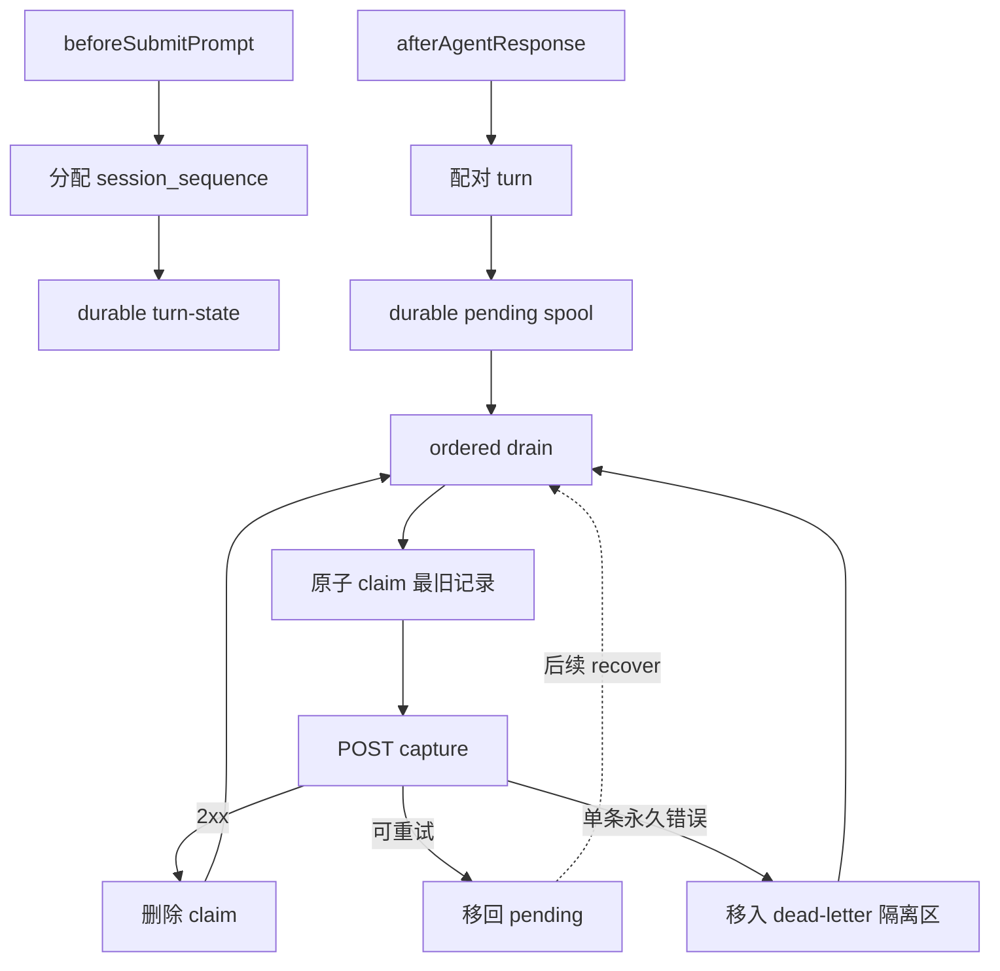
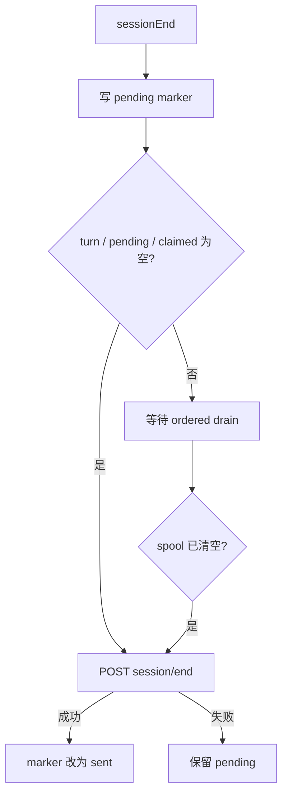

# 【云脑方案文档】Cursor Adapter

## 需求分析

本次只做 Adapter：让 Cursor 以轻量注入、Hook capture、durable spool、机会式 recover 和 MCP 主动检索获得长期记忆。

## 功能需求

### 会话开始：轻量注入

- 注入 L3 Persona，提供稳定偏好。
- 注入 L2 场景导航，路径使用绝对路径。
- 注入简短工具指南，不注入 L1/L0 正文。
- 文件缺失时跳过对应部分，不阻塞会话。

### 会话中：主动检索

检索顺序固定为：

1. 先调用 `tdai_memory_search` 搜索 L1 结构化记忆。
2. L1 不足、需要原话或证据时，再调用 `tdai_conversation_search` 回溯 L0。
3. 命中 L2 场景时，按导航中的绝对路径读取场景块。

**策略：L3/L2 轻注入 → L1 优先搜索 → L0 证据回溯。**

### 一轮结束：可靠投递

- Cursor 为每轮生成稳定 `capture_id`。
- `idempotency_key` 等于 `capture_id`。
- turn 先写 durable spool，再进入 ordered drain（顺序投递）。
- 所有发送路径使用原子 claim。
- 同一会话按旧到新投递，最多一个 capture 在途。
- 服务不可用时保留 spool，由后续机会式 recover 重投。

### 会话结束：等待 capture

- `sessionEnd` 先写入 `pending` end marker。
- 有待配对 turn、pending spool 或 claimed spool 时不调用 `/session/end`。
- 全部 capture 收到 2xx 后再发送 `/session/end`。
- 成功后 marker 转为 `sent`；晚到 completion 先改回 `pending`。
- recover 在 spool 清空后继续 flush pending marker。

### MCP 配置

- 提供 Cursor 全局或项目级 `mcp.json`。
- 只配置现有 stdio MCP。
- 推荐只启用 L1/L0 两个只读检索工具。
- UI 禁用写工具只是操作性防护，不构成安全边界。

## 非功能需求

| 指标 | 要求 |
| --- | --- |
| 前台 capture 网络预算 | 1 秒 |
| hook 总超时 | 5 秒兜底 |
| hook 失败行为 | fail-open，输出 `{}` 并退出 0 |
| 投递保证 | durable at-least-once |
| claim lease | 30 秒 |
| 同会话并发 | 最多一个 capture 在途 |
| 跨会话并发 | 允许并行 |
| 服务端内部实现 | 不在本次范围 |
| MCP server 改动 | 不在本次范围 |

## 现状分析

当前仓库已有长期记忆文件、HTTP Gateway 与 L1/L0 搜索接口，尚无 Cursor Adapter。

Cursor 平台提供本方案所需挂点：

- `sessionStart` 可写入初始 `additional_context`。
- `beforeSubmitPrompt` 提供 user prompt。
- `afterAgentResponse` 提供 assistant response。
- `sessionEnd` 提供会话结束信号。
- 公共字段包含稳定 `conversation_id` 和每轮变化的 `generation_id`。

Hook payload 没有可用于同会话排序的时间字段。因此 Adapter 在 `beforeSubmitPrompt` 的 session lock 内分配 `session_sequence`，不能按 completion 到达顺序排序。

Gateway `/recall` 只返回静态系统上下文，不透传动态 L1 结果。Cursor 每轮也没有可靠的 prompt 改写挂点，因此动态检索由 Agent 通过 MCP 主动完成。

## 收益与风险

### 收益

- 初始上下文保持轻量，减少无关记忆占用。
- L1 先检索、L0 后回溯，兼顾速度与证据完整性。
- write-ahead spool 避免网络故障造成 turn 丢失。
- 原子 claim 避免多个 recover 重复发送同一条。
- 同会话顺序稳定，避免后写记录越过旧记录。

### 风险

| 风险 | 约束 |
| --- | --- |
| Hook fire-and-forget | 所有 hook fail-open，状态先落盘 |
| recover 崩溃 | 30 秒 claim lease 到期后回收 |
| 服务版本不兼容 | 全局阻塞并保留全部 spool |
| 单条坏数据 | 仅隔离该条，继续后续合法记录 |
| MCP 写工具绕过 Adapter | 安装说明要求禁用；明确不是安全边界 |
| recover 非常驻 | 仅在后续触发时承诺继续投递 |

## 业务流程

### 核心流程



### 会话结束



### Recover 触发

| 触发点 | 行为 |
| --- | --- |
| `sessionStart` | 有界处理旧 spool，并检查 pending marker |
| `afterAgentResponse` | 当前 capture 入队后按序 drain，再小批量 recover |
| `sessionEnd` | 尝试清空本会话 spool |
| Gateway 启动成功后 | 执行一次有界 recover |

## 概要设计

### 输入与输出

| 输入 | Adapter 产物/调用 |
| --- | --- |
| Cursor hook payload | 初始上下文、turn-state、capture、session-end |
| `persona.md`、`scene_index.json` | L3 Persona、带绝对路径的 L2 导航 |
| Gateway 地址与鉴权 | health、capture、session-end |
| MCP 配置 | L1/L0 检索入口 |

### Hook 映射

| Hook | 动作 | 输出 |
| --- | --- | --- |
| `sessionStart` | 读取 L3/L2；注入检索指南；有界 recover | `additional_context` |
| `beforeSubmitPrompt` | 分配 sequence；保存 user prompt | turn-state |
| `afterAgentResponse` | 配对 turn；发布 spool；ordered drain | capture |
| `sessionEnd` | 发布 marker；检查未完成状态 | session-end 或 pending |

### Capture 标识

```text
capture_id = cursor:v1:<sha256(canonical([conversation_id, generation_id]))>
idempotency_key = capture_id
```

capture 请求发送：

| 字段 | 必填 | 说明 |
| --- | --- | --- |
| `user_content` | 是 | user 内容 |
| `assistant_content` | 是 | assistant 内容 |
| `session_key` | 是 | `cursor:<conversation_id>` |
| `idempotency_key` | 是 | 等于 `capture_id` |
| `messages` | 不发送 | 避免重复表达同一轮内容 |

### Durable publish

turn-state 与 spool 都使用：

1. 写同目录临时文件。
2. 文件 `fsync`。
3. 原子 rename。
4. 父目录 `fsync`。

completion 在同一 session lock 内读取 turn-state，durable publish spool 后才删除 turn-state。释放锁后触发 ordered drain。

### 原子认领（claim）

同一会话任何时刻最多一个 claim：

1. 在 session lock 内回收超过 30 秒的 stale claim。
2. 已有未过期 claim 时跳过该会话。
3. 按 `session_sequence` 选择最旧 pending spool。
4. 原子 rename 到 `claimed/`。
5. 释放锁后发送网络请求。
6. 按结果删除、回 pending 或移入 dead-letter。

claim 保存 `owner` 与 `claimed_at`。多个 recover 可并行处理不同会话。

### 数据结构

| 键/字段 | 取值 | TTL | 用途 |
| --- | --- | --- | --- |
| `session_key` | `cursor:<conversation_id>` | 随会话状态保留 | 会话分组 |
| `capture_id` | `cursor:v1:<sha256(...)>` | 随 spool 保留 | 稳定 turn 标识 |
| `idempotency_key` | 等于 `capture_id` | 随请求保留 | HTTP 重试标识 |
| `session_sequence` | 会话内单调递增整数 | 随 turn/spool 保留 | 同会话排序 |
| turn-state | conversation + generation + sequence | 24 小时清理孤儿 | turn 配对 |
| pending spool | `<sha256(capture_id)>.json` | claim 前保留 | 等待投递 |
| claimed spool | record + owner + `claimed_at` | 2xx 后删除；30 秒可回收 | 原子占有 |
| end marker | `pending` / `sent` | 下次 sessionStart 清理 sent | 结束屏障 |
| dead-letter | 单条永久错误 | 人工处理后清理 | 失败证据 |
| blocked-auth | 401/403 | 配置修复后恢复 | 全局鉴权阻塞 |
| blocked-incompatible（兼容性阻塞） | 版本或协议不兼容 | 升级或降级后恢复 | 全局兼容性阻塞 |

## 兼容性与失败语义

| 类别 | 情况 | 行为 |
| --- | --- | --- |
| Hook | 内部异常 | 输出 `{}` 并退出 0 |
| 网络 | 网络错误、408、425、429、5xx | claim 移回 pending |
| 单条数据 | 400、409、413、422 | 当前 claim 移入 dead-letter；继续下一条 |
| Gateway 全局 | 401、403 | 标记 blocked-auth；claim 移回 pending |
| Gateway 全局 | `/health` 版本不受支持 | 标记 blocked-incompatible；保留全部 spool |
| Gateway 全局 | capture 返回 404、405 或结构不兼容 | 标记 blocked-incompatible；保留全部 spool |
| MCP 全局 | initialize 拒绝或协议版本不兼容 | 报告兼容性错误；不影响 capture spool |
| MCP 全局 | 缺少 L1/L0 两个只读工具 | 报告兼容性错误；不启用写工具替代 |
| MCP 单次 | 工具调用失败 | 返回本次工具错误 |
| Session end | 请求失败 | marker 保持 pending |

Gateway 兼容性由 `/health.version`、必需接口和响应结构核验。MCP 兼容性由 initialize 与 `tools/list` 核验。支持版本范围随 Adapter 发布物固定。

dead-letter 不自动重试，也不阻塞后续合法 capture。全局阻塞不消费单条重试次数。

## 验收标准

1. 文档和代码均明确本次只做 Adapter。
2. 不修改 Gateway 服务端、TdaiCore、L0 存储或 MCP server。
3. 初始上下文遵循“L3/L2 轻注入 → L1 优先 → L0 证据回溯”。
4. `beforeSubmitPrompt` 在 session lock 内分配 `session_sequence`。
5. completion 先 durable publish spool，再删除 turn-state。
6. 所有发送路径使用原子 claim；stale claim 可在 30 秒后回收。
7. 同一会话严格按 sequence 从旧到新投递，最多一个 capture 在途。
8. capture 不发送 `messages`；2xx 后才删除 claim。
9. 可重试失败移回 pending；单条坏数据只隔离当前 claim。
10. 版本或协议不兼容进入全局阻塞，保留全部 spool。
11. 有 turn、pending spool 或 claimed spool 时不发送 `/session/end`。
12. recover 在 spool 清空后 flush pending end marker。
13. MCP 只新增配置、检索策略与兼容性检查。
