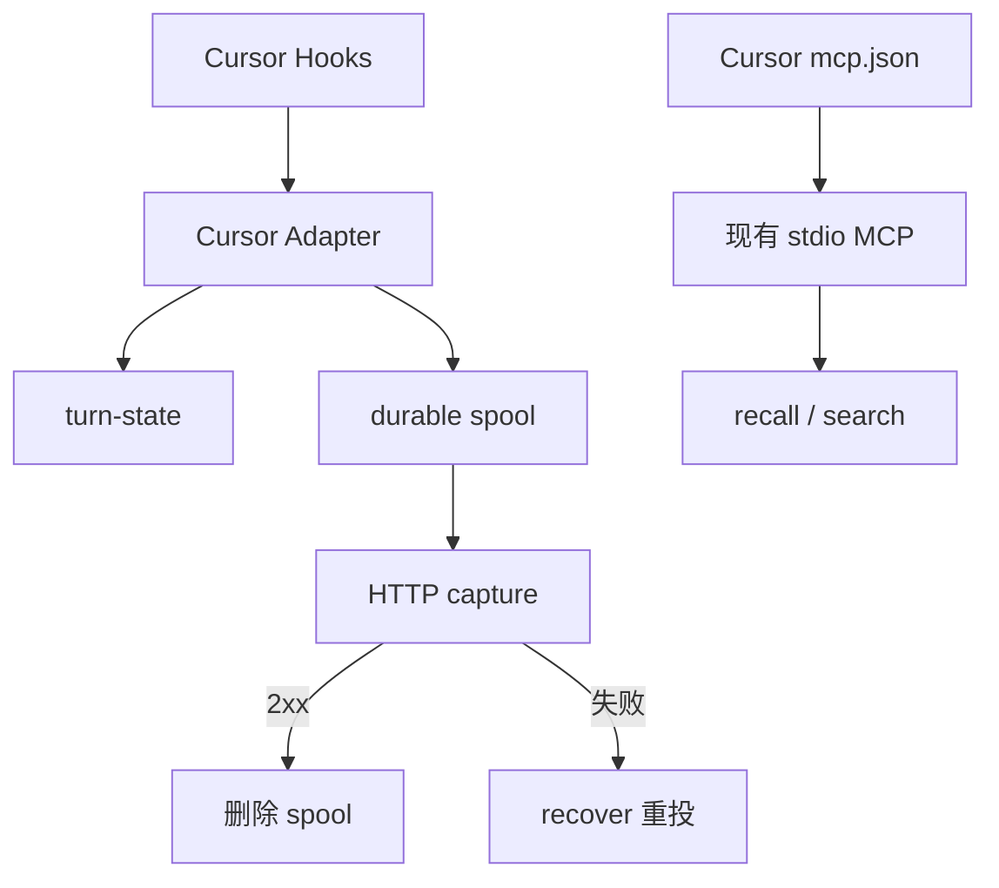

# Spec：Cursor Adapter

## 本次只做 Adapter

本次交付只实现 Cursor Adapter：接入 Cursor Hooks、加载长期记忆、可靠投递对话、配置检索工具，并在 capture 完成后结束会话。

不修改 Gateway 服务端、TdaiCore、L0 存储、MCP server 或公共持久化语义。

## 目标

v1 为 Cursor 提供 L0→L3 长期记忆：

- 会话开始注入 L3 Persona 与 L2 场景导航。
- 一轮结束后可靠投递 L0 capture。
- 会话中通过现有 MCP 工具主动检索。
- 全部 capture 被服务端接受后再结束会话。

## 范围

| 范围 | 结论 |
| --- | --- |
| Cursor Agent Hooks | 支持 |
| Cursor 本地 stdio MCP 配置 | 支持 |
| Cursor Adapter 安装与测试 | 支持 |
| Gateway 服务端改动 | 不包含 |
| TdaiCore 与 L0 存储改动 | 不包含 |
| MCP server 改动 | 不包含 |
| Cloud agents | 不包含 |
| Cursor CLI | 不包含 |
| 符号短期记忆 offload | 不包含 |
| 多用户、多记忆库隔离 | 不包含，沿用单 dataDir |

## 输入与输出

| 输入 | Adapter 产物/调用 |
| --- | --- |
| Cursor hook payload | 初始上下文、turn-state、capture 请求、session-end 请求 |
| `persona.md`、`scene_index.json` | L3 Persona 与带绝对路径的 L2 导航 |
| Gateway 地址与鉴权配置 | HTTP capture、health、session-end 调用 |
| MCP 配置 | recall/search 工具入口 |

## 总体方案



Cursor Adapter 只负责客户端状态与调用时序。服务端返回 2xx 时视为请求已被接受；Adapter 不声明服务端内部写入方式。

## MCP 配置

Cursor 从项目级 `.cursor/mcp.json` 或全局 `~/.cursor/mcp.json` 加载配置：

```json
{
  "mcpServers": {
    "tencentdb-memory": {
      "command": "memory-tencentdb-mcp",
      "env": {
        "TDAI_GATEWAY_URL": "http://127.0.0.1:8420",
        "TDAI_GATEWAY_API_KEY": "replace-me"
      }
    }
  }
}
```

推荐在 Cursor MCP 工具界面只启用 recall/search，禁用 `tdai_capture` 与 `tdai_session_end`。该设置可被用户撤销，只是操作性防护；重新启用写工具后，写操作会绕过 Adapter 的 spool 与 end marker。

## Hook 映射

| 输入 | 动作 | 输出 |
| --- | --- | --- |
| `sessionStart` | 分别读取 L3 与 L2；有界 recover 旧 spool | `additional_context` |
| `beforeSubmitPrompt` | 按 conversation/generation 保存 user prompt | turn-state |
| `afterAgentResponse` | 配对 turn，先落 spool，再调用 `/capture` | L0 capture |
| `sessionEnd` | 检查本会话 turn-state 与 spool | `/session/end` 或 pending end marker |

`sessionStart` 没有 query，不调用 recall；它直接读取 `persona.md` 与 `scene_index.json`。文件缺失时跳过对应部分，不阻塞会话。

## Capture 标识

每轮使用稳定的 Adapter 内部标识：

```text
capture_id = cursor:v1:<sha256(canonical([conversation_id, generation_id]))>
idempotency_key = capture_id
```

`capture_id` 使用小写十六进制 SHA-256，保持有界 ASCII。capture 请求发送：

- `user_content`
- `assistant_content`
- `session_key`
- `idempotency_key`

Adapter 不发送可选 `messages`，也不提交服务端内部指纹。

## Durable spool

durable spool 是先于网络请求落盘的持久队列文件。

completion 的 turn-state→spool 转换必须在同一 session lock（会话锁）内完成：

1. 获取 session lock。
2. 按 conversation/generation 读取 turn-state。
3. 写临时 spool，完成文件 `fsync`、原子 rename 与父目录 `fsync`。
4. spool 发布成功后删除 turn-state。
5. 释放 session lock。
6. 调用 `/capture`。
7. 收到 2xx 后删除 spool。

多个 recover 可处理同一 spool；读取或删除时遇到 `ENOENT`，视为已被其他 recover 处理。

Adapter 保证 durable at-least-once delivery，不声明服务端跨重启去重或 effectively-once。

## Recover

recover 不作为常驻 daemon：

| 触发点 | 行为 |
| --- | --- |
| `sessionStart` | 有界处理旧 spool |
| `afterAgentResponse` | 优先发送当前 capture，再小批量 recover |
| `sessionEnd` | 尝试清空本会话 spool |
| Gateway 启动成功后 | 执行一次有界 recover |

recover 每次成功投递 capture 后，都检查该会话的 pending end marker。若 turn-state 与 spool 均为空，立即重试 `/session/end`。即使启动 recover 时已经没有 spool，也执行一次该检查。

只有服务最终恢复且后续至少触发一次 recover 时，pending spool 才能完成投递。

## Session end

同一 session lock 覆盖 turn-state、spool 与 end marker（结束标记）的状态转换：

- `sessionEnd` 先 durable publish `pending` marker。
- 有待配对 turn 或未 ACK spool 时，不调用 `/session/end`。
- 本会话 capture 全部收到 2xx 后，再调用 `/session/end`。
- recover 启动或每次成功投递后，检查并 flush 满足条件的 `pending` marker。
- 请求成功后将 marker 原子改为 `sent`，不立即删除。
- 晚到 completion 发现 `sent` 时，先改回 `pending`，再发布 spool。
- 下一次 `sessionStart` 确认无待处理状态后，清理 `sent` marker。

`/session/end` 失败时保留 `pending`。合法的延迟 completion 必须已有 turn-state；无 turn-state 的后到 completion 视为协议错误。

## 数据结构

| 键/字段 | 取值 | TTL | 用途 |
| --- | --- | --- | --- |
| `session_key` | `cursor:<conversation_id>` | 随会话数据保留 | 会话分组 |
| `capture_id` | `cursor:v1:<sha256(...)>` | 随 spool 保留 | 稳定 turn 标识 |
| `idempotency_key` | 等于 `capture_id` | 随请求保留 | HTTP 重试标识 |
| turn-state | conversation + generation | 24 小时清理孤儿 | turn 配对 |
| spool | `<sha256(capture_id)>.json` | 2xx 后删除 | 可靠重投 |
| end marker | `pending` / `sent` | 下次 sessionStart 清理 sent | session-closing barrier |
| dead-letter | permanent protocol error | 人工处理后清理 | 失败证据 |
| blocked-auth | 401/403 | 配置修复后恢复 | 鉴权阻塞 |

## 失败语义

| 情况 | 行为 |
| --- | --- |
| hook 内部异常 | 输出 `{}` 并退出 0 |
| 网络错误、408、425、429、5xx | 保留 spool，后续 recover 重投 |
| 409 | 转入 dead-letter |
| 400、404、405、413、422 | 转入 dead-letter |
| 401、403 | 标记 blocked-auth |
| `/session/end` 失败 | 保持 marker 为 `pending` |
| MCP 调用失败 | 返回工具错误 |

dead-letter 不自动重试；blocked-auth 仅在鉴权配置变化或显式人工重试后恢复。前台 capture 网络预算为 1 秒，hook 总超时为 5 秒并 fail-open。

## 验收

1. 文档和代码均明确本次只做 Cursor Adapter。
2. Adapter 不修改 Gateway、TdaiCore、L0 存储或 MCP server。
3. hook、capture 与 recover 统一使用现有 HTTP client。
4. `capture_id` 为稳定的有界 ASCII 哈希，且 `idempotency_key = capture_id`。
5. completion 在同一 session lock 内先 durable publish spool，再删除 turn-state。
6. spool 使用临时文件、文件 `fsync`、原子 rename 与父目录 `fsync` 发布。
7. capture 不发送可选 `messages`；2xx 后才删除 spool。
8. 可重试失败保留 spool；永久错误进入 dead-letter 或 blocked 状态。
9. 有待配对 turn 或未 ACK spool 时不发送 `/session/end`。
10. MCP 只新增 Cursor 配置与写工具禁用说明。
