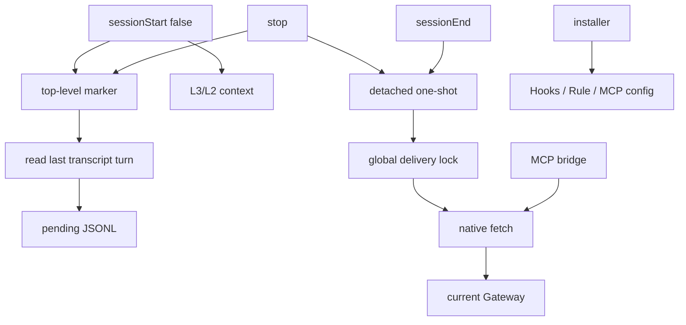

# Cursor Adapter Spec

## 结论

v1 保留薄 Outbox 与 detached one-shot。顶层交互式 `sessionStart` 先写 marker；`stop` 只在 marker 存在时从 transcript 提取最后完整轮次，每轮只有一个 append-only pending JSONL：

```text
sessionStart(false)
  → top-level marker
stop
  → require marker
  → read last transcript turn
  → append-only pending JSONL
  → detached one-shot
  → global delivery lock
  → current Gateway
```

前台 Hook 只读取指定 transcript、做一次本地追加、读取必要上下文或 spawn，不执行 HTTP、Gateway 启动、健康检查和 pending 全量扫描。

## 范围

| 范围 | v1 |
| --- | --- |
| Cursor 本地 IDE（Linux、macOS） | 目标平台；先通过 Hook spike |
| pending 所在文件系统 | 本地文件系统；不支持网络挂载 |
| Windows | 不支持；现有 Gateway 控制入口是 Bash 脚本 |
| L3/L2 轻量注入 | 支持 |
| MCP L1/L0 主动检索 | 支持 |
| 每轮一个 pending JSONL | 支持 |
| detached one-shot | 支持 |
| Cursor CLI、Cursor Cloud | 不支持 |
| Gateway、TdaiCore、L0 改动 | 不实现 |
| 服务端 keyed capture | 不依赖 |
| sequence、FIFO、claim、fencing | 不实现 |
| daemon、常驻 worker pool | 不实现 |

当前 checkout 已实现 Cursor Adapter、Hook binary 和安装器。v1 不等待未合并的 #316 client；Adapter 用 Node 原生 `fetch` 调用现有 Gateway。Linux transcript 采集门禁已通过；Hook timeout 与真·Background Agent 未闭环前，不宣称发布验收完成。

## 实现前 Hook spike

> Linux / Cursor 3.12.30 实测快照见 [docs/spike/2026-07-30-linux-cursor-3.12.30.md](../spike/2026-07-30-linux-cursor-3.12.30.md)（索引：[docs/spike/INDEX.md](../spike/INDEX.md)）。以下条目仍是门禁定义；以最新 spike 报告为准更新「通过/改设计」状态。

spike 是 Adapter 安装启用与发布前门禁。在 Linux、macOS 的目标 Cursor IDE 上记录真实事件，不用文档推断运行时；当前代码骨架可先实现和单测，但未通过 spike 前不得启用生产 capture 或宣称发布验收完成：

1. 同一轮 `beforeSubmitPrompt`、全部 `afterAgentResponse`、`stop` 的 `generation_id` 是否相同。
2. 一轮是否有多次 `afterAgentResponse`，且全部追加完成后才触发 `stop`。
3. detached 子进程能否活过父 Hook 退出与 Hook timeout。
4. Hook `timeout` 的单位和目标 Cursor 版本默认值。
5. `sessionStart.additional_context` 是否能在首轮被 Agent 看到。
6. 主 Agent、子代理和后台 Agent 分别触发哪些 Hook；capture 相关 Hook 是否有稳定字段可排除非主 Agent。
7. `transcript_path` 在 `stop` 时是否存在，格式是否稳定，是否完整包含本轮 prompt 与全部 assistant 正文。

[Cursor Hooks 官方文档](https://cursor.com/docs/hooks.md)没有承诺第 1、2、3、5、6、7 项足以支撑本方案。spike 结果按以下门禁处理：

| 结果 | 处理 |
| --- | --- |
| generation 不能跨 Hook 关联 | 改用实测可证明的归并键，再评审 |
| response 可能晚于 `stop` | 停止实施当前封口边界 |
| detached 不能存活 | 停止实施 one-shot 骨架 |
| 首轮看不到注入 | 重新设计注入入口或收窄范围，再评审 |
| 无法稳定排除子代理/后台 Agent | 停止 capture 实施，不静默混入独立会话 |
| transcript 稳定且能无歧义还原本轮 | 采用 transcript 路径 |
| transcript 不满足条件 | 采用 JSONL fallback |

Linux / Cursor 3.12.30 已确认跨 Hook generation 关联不可靠；Agent 复核的 6 个可比轮次中，transcript 提取的 user/最终 assistant 长度与对应 Hook 记录均为 6/6 一致，且都有 `turn_ended`。因此采用 transcript 路径并删除生产 before/after 采集链。证据见 [docs/spike-agent/INDEX.md](../spike-agent/INDEX.md)。

`sessionStart` 用 `is_background_agent === false` 标记顶层交互式会话；后台或未分类会话不注入并清除同会话 marker。该 fail-closed 分类已实施，但不能替代真·Background Agent 生命周期证据。Hook timeout、真·Background Agent 和后台 Task Stop 仍是发布门禁。

## 可靠性边界

pending JSONL 不做 `fsync`。本方案覆盖正常进程退出、Hook/one-shot 崩溃和网络失败，不承诺主机掉电或操作系统崩溃时保住最后一轮。写入中崩溃时，当前事件可能丢失；首尾换行只保证后续完整事件仍可解析。

收到 capture HTTP 2xx 后删除 pending。删除不做目录 `fsync`，因此掉电后文件可能重现并再次投递。Adapter 明确接受：

- 响应丢失或删除回滚导致重复 capture。
- 不保证消息时间是实际发生时间。
- 不保证 L0 日期分片对应消息发生日期。
- 不保证服务端顺序与用户实际轮次一致。
- 不保证 2xx 最终形成 L0 记录。

对明确永久无效的请求，Adapter 写 bounded 错误摘要后删除 pending。日志不保存完整 prompt 或 response，也不承担恢复功能。

## 已验证的 Gateway 语义

当前 `CaptureRequest` 为：

```ts
interface CaptureRequest {
  user_content: string;
  assistant_content: string;
  session_key: string;
  session_id?: string;
  user_id?: string;
  messages?: unknown[];
}
```

Adapter 只发送三个必填字段：

```text
user_content
assistant_content
session_key = cursor:<conversation_id>
```

不发送 `session_id`、`user_id` 或 `messages`，不增加 sequence、`capture_id` 或 `idempotency_key`。

重复 capture 可能重复写 L0、增加 L1 conversation count、触发重复抽取或额外 LLM 调用。全局投递锁只消除 Adapter 自身的并发投递，不能消除“服务端已处理、客户端未收到响应”的重投。

### 主干已知缺陷：首轮可能返回 `l0_recorded = 0`

Gateway 未收到 `messages` 时，新 session 首次 capture 存在同毫秒竞态：

1. `src/core/tdai-core.ts:279` 用 `Date.now()` 生成 `pluginStartTimestamp`。
2. `src/utils/checkpoint.ts:469-472` 在无 cursor 时把它作为过滤下界。
3. Gateway 合成的消息没有 timestamp，`src/core/conversation/l0-recorder.ts:556` 再次使用 `Date.now()`。
4. `src/core/conversation/l0-recorder.ts:157-160` 使用严格 `timestamp > cursor`。

两个时间相等时，首轮被过滤，Gateway 仍返回 2xx 和 `l0_recorded = 0`。正常内容过滤也会返回 0，Adapter 无法用该字段判断是否重投；2xx 仍是唯一 ACK。

发送真实 timestamp 会更差：one-shot 在轮次结束后才懒启动 Gateway，消息时间必然早于新建的 `pluginStartTimestamp`，整轮会被严格 cursor 系统性过滤。稳定消息 ID 也不参与当前 position/timestamp 增量过滤。因此 v1 保留“不发送 `messages`”，该主干缺陷不在 Adapter 中修复。

## 架构与 I/O



`stop` 从 transcript 生成 user、assistant、stop 记录，并用一个 Buffer 一次追加，不增加另一种 pending 格式。

| 模块 | 输入 | 输出 |
| --- | --- | --- |
| Hooks | Cursor payload、L3/L2 文件 | context、pending 记录、one-shot spawn |
| pending | user、assistant、stop 事件 | 每轮一个可折叠 JSONL |
| one-shot | pending 目录、可选 `sessionEnd` 请求 | capture、清理、best-effort `/session/end` |
| gateway request | URL、API key、body、timeout | HTTP status/body 或网络错误 |
| MCP bridge | 两个只读工具调用 | L1/L0 查询结果 |
| installer | 用户与项目现有配置 | 无重复的 Hooks、Rule、MCP 配置 |

## Hook 前台行为

| Hook | 前台行为 |
| --- | --- |
| 顶层交互式 `sessionStart` | 原子写入哈希命名的空 marker；读取并返回 L3/L2 context；不 spawn |
| 后台或未分类 `sessionStart` | 清除同会话 marker；不注入；不 spawn |
| `stop` | marker 存在时读取 `transcript_path` 最后完整轮次；一次 O_APPEND 写入 user、assistant、stop；无论是否分类都 spawn detached one-shot |
| `sessionEnd` | spawn 带 `sessionEnd` 请求的 detached one-shot；清除会话 marker |

生产安装器不注册 `beforeSubmitPrompt`、`afterAgentResponse`。升级时删除本 Adapter 旧版本在这两个事件下的 marker-owned command，保留其他工具配置。

会话 marker 位于 Adapter 根目录的 `sessions/`，文件名是 conversation id 的 SHA-256，内容为空；临时文件写入后原子 rename。marker 不存在或访问失败时 `stop` fail-closed，不读取 transcript。

transcript 根目录可配置，默认 `<home>/.cursor/projects`。transcript 解析先校验根目录与目标文件的真实路径，拒绝符号链接越界；目标还必须位于 `agent-transcripts` 下。解析以最后一个 `turn_ended` 为边界，只处理前一个 `turn_ended` 之后的最后一轮：提取最后一条 user message 的 `<user_query>` 正文，以及该轮最后一条非空 assistant text。最后边界后若已有未完成 user/assistant、文件读取期间 size/mtime/ctime/inode 变化或文件超过 16 MiB，均不写 pending，但仍 fail-open 并唤醒 worker。

v1 目标只 capture 顶层交互式 Agent；不注册 `subagentStart` / `subagentStop`。真·Background Agent 的 `stop` 行为尚未验证，因此生产发布门禁未关闭。

所有 Hook fail-open：内部异常写 bounded 日志并退出 0。只观察事件且无输出字段的 Hook 返回 `{}`；其他 Hook 返回各自 schema 的最小非阻断响应。

前台不承诺固定毫秒数。性能验收只检查前台没有网络、Gateway 启动、健康检查、旧 pending 读取或全目录扫描。

## 轻量注入与检索

`sessionStart`：

1. 读取 `persona.md`，只保留 L3。
2. 读取 `scene_index.json`，生成带绝对路径的 L2 导航。
3. 注入简短工具提示。

文件缺失时跳过对应部分；两者都缺失时不注入空标签。首轮可见性以 spike 为准。

Cursor Rule：

```text
任务依赖历史偏好、既往决策或项目经验时，
先调用 tdai_memory_search。

需要原话、时间线或证据时，
再调用 tdai_conversation_search。

命中场景导航后，按绝对路径读取正文。
自包含任务不主动检索。
不要调用 tdai_capture 或 tdai_session_end。
```

stdio MCP bridge 只注册：

- `tdai_memory_search` → `POST /search/memories`
- `tdai_conversation_search` → `POST /search/conversations`

模型检索属于 best-effort 策略。

## Pending JSONL

```text
session_key = cursor:<conversation_id>
pending_key = sha256(canonical_json([conversation_id, stop_generation_id]))
```

Cursor 没有约束 ID 的字符集和长度。Hook 输入不直接拼接路径；哈希输入使用 UTF-8，输出使用小写十六进制。conversation、generation 可从 pending 首条有效记录读取，不靠文件名排障。

```text
~/.memory-tencentdb/cursor/
├── pending/
│   └── <pending_key>.jsonl
└── logs/
    └── cursor-hook.log
```

每行是一条 versioned event：

```json
{"v":1,"event":"user","conversation_id":"...","generation_id":"...","text":"...","at_ms":0}
{"v":1,"event":"assistant","conversation_id":"...","generation_id":"...","text":"...","at_ms":0}
{"v":1,"event":"stop","conversation_id":"...","generation_id":"...","status":"completed","at_ms":0}
```

`stop` 把三条完整 UTF-8 记录编码为一个 Buffer，以 `O_APPEND | O_CREAT` 打开同一路径，只发起一次 `write`，不读旧 pending、不加 turn lock、不 `fsync`。该追加契约只适用于目标平台的本地文件系统。实现检查 `bytesWritten`；短写只记日志，不重试当前尾部，当前轮可能丢失。

每条记录以换行开头和结尾。若进程在写入中崩溃，下一条记录仍可从下一行恢复；one-shot 跳过空行和无法解析的行。

one-shot 按文件顺序折叠：

1. 第一条有效 user 提供 prompt 和标识。
2. 收集第一条 stop 之前的非空 assistant。
3. 第一条 stop 封口。
4. 同时存在 user、至少一条 assistant 和 stop 才可投递。

重复 user、重复 stop 和 stop 后记录不生成额外状态；安装器负责防止双作用域造成正常事件重复执行。

不创建 outbox、failed、turn lock、状态索引、sequence、claim、end marker 或 recover cursor。

one-shot 只在自己获得全局锁后读取和删除文件。单次 write 在 spawn 前完成，不存在跨 Hook late response 写入已删除文件的依赖。

## Detached one-shot

one-shot 是短生命周期进程，每次处理后退出：

1. 最多等待约 120 秒获取全局投递锁；失败记 bounded 日志并退出。
2. 清理超过 24 小时的不完整 pending。
3. 仅在有完整 pending 或 `sessionEnd` 请求时调用 `scripts/memory-tencentdb-ctl.sh start`。
4. Gateway 可用后扫描全部完整 pending。
5. 串行调用 `POST /capture`。
6. 成功处理一批后重新扫描，直到锁内没有完整 pending。
7. 尝试可选的 best-effort `POST /session/end`。
8. 释放锁并退出；释放失败只记 bounded 日志。

全局锁必须保留。`scripts/memory-tencentdb-ctl.sh:226-257` 的 `cmd_start` 是“检查端口 → spawn”，两个 one-shot 并发会重复拉起 Gateway。锁同时保证本地 HTTP 不并发，并让等待者在前一个扫描结束后再次全量扫描。

Adapter 实现须加入并固定 `proper-lockfile` 依赖，不手写 PID、token、mtime 和 stale 接管协议。它锁 Cursor Adapter 根目录，以 1 秒间隔最多重试 120 次，并持续更新 mtime heartbeat；stale/update 配置须通过“Gateway 启动 + 超过 60 秒持锁请求”集成测试，期间不得出现第二个 owner。锁被判定 compromised 时退出并保留 pending。

只有 `stop` 和 `sessionEnd` 才启动 one-shot。任意一次 one-shot 都在锁内扫描所有 session，因此不需要 `sessionStart` 机会式 recover。

spawn 使用 detached、忽略 stdio 和 `unref`。spawn 失败或 one-shot 崩溃时 pending 保留，只由后续 `stop` 或 `sessionEnd` 再次唤醒。若没有后续事件，pending 会长期滞留；v1 是机会式重投，不承诺完整 at-least-once。

`sessionEnd` 不写持久状态，也不等待未封口 pending。one-shot 在 drain 后 best-effort 调用 `/session/end`；失败或超时只记日志。

## Gateway request 与 timeout

Adapter 以一个本地 `gatewayRequest()` 包装 Node 原生 `fetch`：

- JSON 请求写 `Content-Type: application/json`。
- 配置 API key 时写 `Authorization: Bearer <key>`。
- 使用 `AbortSignal.timeout(timeoutMs)`。
- 返回 HTTP status 和 bounded body/error。

当前 Gateway 在 `src/gateway/server.ts:290-312` 使用上述 Bearer 契约。该薄封装同时供 one-shot 与 MCP bridge 使用，不引入 `GatewayMemoryClient` 前置。

`/capture` 默认 timeout 为 60 秒并可配置。超时保留 pending，结束本次 drain，不在同一进程立即重投。detached 使该 timeout 不计入前台 Hook 等待。

Cursor Hook timeout 与 HTTP timeout 是两个配置；前者以 spike 实测为准。

## HTTP 结果

| Capture 结果 | 本地处理 |
| --- | --- |
| 2xx，包括 `l0_recorded = 0` | 删除 pending |
| 网络错误、超时、408、425、429、5xx | 保留 pending；结束本次 drain |
| 401、403、404、405 | 保留 pending；结束本次 drain |
| 明确表示 payload/schema/大小永久无效的 400、413、415、422 | 写 bounded 摘要，删除 pending，继续 |
| 其他 4xx、无法解析或无法判断 | 保留 pending；结束本次 drain |

只有相同请求未来重投也不可能成功，才能按永久错误删除。`sessionEnd` 的所有结果只写 bounded 日志。

## 清理与日志

| 状态 | 清理 |
| --- | --- |
| 无法折叠为完整 capture 的 pending | 最后修改 24 小时后，在下次 one-shot 中 best-effort 删除 |
| 完整 pending | 仅在 capture 2xx 或明确永久错误后删除 |
| `cursor-hook.log` | 按大小上限轮转 |

日志只保存 event、pending key、HTTP status 和 bounded 错误，不保存完整 user/assistant 内容。Hook JSON 解析失败只记录固定 `invalid_json`，避免解析器错误带出输入片段。日志失败不阻塞 Hook 或 one-shot。

## 安装

安装器管理：

```text
.cursor/hooks.json 或 ~/.cursor/hooks.json
.cursor/mcp.json 或 ~/.cursor/mcp.json
.cursor/rules/tencentdb-memory.mdc
```

Cursor 会合并用户级和项目级 Hook，同一事件下两边命令都会执行。安装器因此：

1. 安装到用户选择的一个作用域。
2. 安装前同时解析项目级与用户级 `hooks.json`。
3. 安装器写入含固定标识 `tencentdb-memory-cursor-v1` 的规范 command；Hook 按完整规范 command 精确识别，MCP 按专用 env marker 识别，不做任意子串或尾缀匹配。
4. 若另一作用域已有该标识，拒绝重复安装并报告路径。
5. 同一作用域重复安装保持不变。
6. 只增删 Adapter 自己的 command、MCP 名称和 Rule 文件。
7. 保留未知字段及其他工具配置，原子写回。
8. 卸载只修改用户指定的作用域。

Enterprise/Team 配置不在本地安装器的可控范围；发现固定 Adapter 标识时报告冲突，不尝试覆盖。

## 测试

### 单元测试

- transcript 只提取最后一个 `turn_ended` 封口的轮次。
- 最后封口后已有未完成轮次、路径越界、读取中变化或超过 16 MiB 时拒绝 capture。
- transcript 必须位于配置根目录真实路径内；符号链接越界时拒绝 capture。
- 只有顶层交互式 `sessionStart` 写 marker 和注入；未分类 `stop` 不 capture。
- `<user_query>` 包裹正文与最后一条非空 assistant text 可稳定提取。
- `stop` 用一次 O_APPEND 写入完整 user、assistant、stop。
- 崩溃截断行不妨碍后续完整行被折叠。
- user、assistant 或 stop 缺失时不投递；24 小时后由下次 one-shot 清理。
- 完整 pending 不按 TTL 清理。
- `stop` 即使 transcript 解析失败也 spawn；`sessionStart` 不 spawn。
- bounded logger 不写完整内容，失败时 fail-open。
- spike recorder 只保存 transcript path 哈希，不保存绝对路径。

### 契约测试

- fake Gateway 校验 capture 只含三个必填字段，不发送 `messages`。
- 2xx 是唯一成功边界，`l0_recorded = 0` 仍删除 pending。
- timeout、retryable、鉴权、版本和未知错误保留完整 pending。
- 两个 one-shot 在同一全局锁内串行；等待者获得锁后重新扫描。
- 锁等待约 120 秒后退出；owner 重复扫描并处理持锁期间新增的 pending。
- 持锁超过 Gateway 启动加 60 秒请求期间不发生 stale 接管；compromised lock 退出并保留 pending。
- 锁获取、释放和 pending 删除失败写 bounded 日志；删除失败时 pending 保留。
- `gatewayRequest()` 的 JSON、Bearer、timeout 与错误映射符合 Gateway。
- `/session/end` 失败不产生持久状态。
- 双作用域已有固定 Adapter 标识时安装器拒绝新增。
- 安装升级删除本 Adapter 旧 before/after Hook，保留其他 command。

### 集成与发布证据

- Gateway 停止时完成一轮：前台返回，one-shot 拉起 Gateway 并投递。
- one-shot 崩溃时完整 pending 保留；有后续 `stop` 或 `sessionEnd` 时可推进。
- L3 缺失但 L2 存在时仍注入绝对路径导航。
- 两个只读 MCP 工具可见并能返回结果。
- 前台 Hook 不执行 HTTP、Gateway 启动、健康检查、旧 pending 读取或全量扫描。
- Hook spike 留存主/子/后台 Agent、首轮注入、transcript、事件关联和 detached 存活证据 → 见 [docs/spike/INDEX.md](../spike/INDEX.md)。
