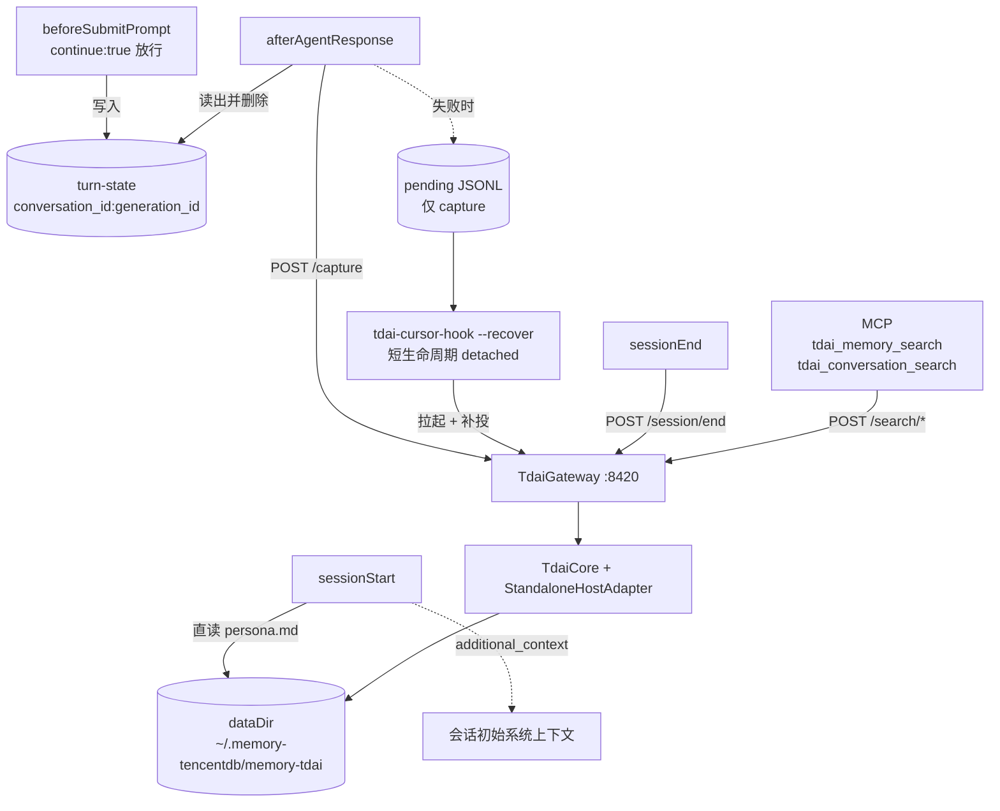

# Spec: Cursor Adapter

## 目的

把 **TencentDB Agent Memory** 接到 **Cursor**，让 Cursor Agent 能用同一套符号短期记忆 + 分层长期记忆。

上游：[TencentCloud/TencentDB-Agent-Memory](https://github.com/TencentCloud/TencentDB-Agent-Memory)

## 范围

上节是长期目标。**v1 只做分层长期记忆**（L0→L3 的召回与落库），符号短期记忆留到 Cursor 提供上下文改写能力之后。

| Non-goal | 说明 |
| --- | --- |
| 符号短期记忆 offload | Cursor 无每轮上下文改写点，`preCompact` 仅可观测（[hooks 文档](https://cursor.com/docs/hooks.md)） |
| Cloud agents | v1 未支持 |
| Cursor CLI | v1 未支持 |
| 多用户 / 多记忆库隔离 | v1 全局单库 |
| 每轮强制注入召回 | 轮内召回交给 Agent 主动调 MCP 工具 |

## 架构



记忆引擎复用现有 HTTP Gateway（`src/gateway/server.ts`），与 Hermes provider 同一条已验证路径。Cursor 侧只有薄客户端。

## 挂点映射

| Cursor 挂点 | 动作 | 依据 |
| --- | --- | --- |
| `sessionStart` | 读 `persona.md` → `additional_context` | 唯一可注入初始系统上下文的挂点；`/recall` 要求非空 `query`（`src/gateway/server.ts:374`）而此挂点无 prompt，故直读文件（同 `src/core/hooks/auto-recall.ts:148`） |
| `beforeSubmitPrompt` | 记录 `prompt` 到 turn-state，返回 `continue:true` | `afterAgentResponse` 只提供 assistant `text`，user 消息必须在此捕获 |
| `afterAgentResponse` | 配对成 turn → `POST /capture` | 对应上游 `agent_end` / Hermes `sync_turn`（`src/core/tdai-core.ts:265`） |
| `sessionEnd` | `POST /session/end` | 只 flush 本会话，不 destroy（`src/core/tdai-core.ts:328` 明确区分两种语义） |
| MCP stdio server | 2 个检索工具 → `/search/*` | 轮内召回的唯一自动通道，Cursor 会按相关性自主调用 |

## 关键设计决策

**hook 脚本只用 Node 内置模块。** 每个 hook 都是一次全新进程；一旦 import `TdaiCore` 会连带拉起 sqlite-vec、`ai`、tiktoken，冷启动从 ~50ms 涨到 1s 以上。重活全部隔在 Gateway 侧。

**不做请求前 health check。** 直接 POST。连接失败或超时才触发拉起与补投，省掉每次一个 RTT。

**hook 网络预算约 1s。** 超时即视为失败转 pending，绝不拖慢用户的一轮对话。

**turn-state 而非 transcript。** Cursor 提供 `transcript_path`，但文件格式未文档化。自建 turn-state 换取稳定性。

**capture 幂等。** 1s 预算可能在 Gateway 已受理后超时，补投会造成重复落库，故引入 `capture_id`。

**注入内容剥离场景导航。** `persona.md` 尾部会被追加场景导航段（`src/core/scene/scene-extractor.ts:435-474`），注入前需剥离，语义同 `stripSceneNavigation`（`src/core/profile/profile-sync.ts:51`）。因 hook 不得引入非内置依赖，此逻辑在 `src/adapters/cursor/` 内以零依赖纯函数重新实现，并与上游行为做一致性单测。

## 数据契约

| 键 | 取值 | 语义 |
| --- | --- | --- |
| `session_key` | `cursor:<conversation_id>` | 纯会话命名空间。L0 按此逐行过滤（`src/core/conversation/l0-recorder.ts:353-355`）；L1/L2/L3 在 dataDir 内全局可见，`session_key` **不是**隔离边界 |
| turn-state 键 | `<conversation_id>:<generation_id>` | `generation_id` 每条用户消息变化，保证并发与重复轮次不串味 |
| `capture_id` | `<conversation_id>:<generation_id>` | 幂等键 |
| 隔离边界 | dataDir | v1 唯一隔离手段。`actorId` 上游硬编码 `default_user`（`src/core/tdai-core.ts:249`），`user_id` 不参与召回隔离 |

turn-state 文件落在 `~/.memory-tencentdb/cursor/turns/`。`afterAgentResponse` 取出后立即删除；`sessionEnd` 清理本会话残留；超过 24h 的孤儿文件在任意 hook 运行时顺带清除。

## 上游改动

唯一需要动上游的地方：`POST /capture` 增加可选字段 `capture_id`。Gateway 侧维护近期 `capture_id` 集合，命中则直接返回已受理，不重复进入 pipeline。字段可选，不影响 Hermes 与 OpenClaw 现有调用。

## 失败语义

全部 fail-open，不设 `failClosed`。

| 情况 | 行为 |
| --- | --- |
| 任何异常 | 始终 `exit 0` 并输出 `{}`；日志写 `~/.memory-tencentdb/logs/cursor-hook.log`（带体积上限轮转） |
| `persona.md` 缺失或为空 | 静默返回 `{}`，不注入 |
| `/capture` 连接失败或超时 | 追加 pending JSONL，detached 启动 `tdai-cursor-hook --recover` |
| `--recover` | 短生命周期进程：`scripts/memory-tencentdb-ctl.sh start`（lock 文件防并发）→ 有上限地轮询 `/health` → flush pending → 退出 |
| pending 队列 | 仅承载 capture。`/session/end` 与 `/search/*` 失败即丢弃 |
| `timeout` 配置 | 统一 5s（远大于 1s 网络预算，仅作兜底） |

## 代码布局

```
src/adapters/cursor/
  hook-router.ts     # 纯函数: payload -> 决策，无 IO
  session-start.ts   # persona.md -> additional_context
  turn-state.ts      # 暂存 / 配对 / 清理
  gateway-client.ts  # 薄 HTTP + pending + recover 触发
src/mcp/server.ts    # stdio MCP，2 工具转发 /search/*
bin/tdai-cursor-hook.mjs   # 唯一入口，按 hook_event_name 分派；支持 --recover
bin/tdai-mcp-server.mjs
scripts/install-cursor.sh
docs/cursor.md
```

MCP server 需新增 `@modelcontextprotocol/sdk` 依赖（当前仓库无 MCP 实现）。

## 安装与卸载

`scripts/install-cursor.sh` 写 `~/.cursor/hooks.json` 与 `~/.cursor/mcp.json`（用户级，与全局单库一致）。要求：

- **原子 merge**：读取现有 JSON → 合并本插件条目 → 写临时文件 → `rename` 覆盖。绝不整体覆盖用户已有配置。
- **绝对路径**：hook `command` 与 MCP `command` 均写绝对路径，不依赖 hook 工作目录。
- **幂等**：重复执行结果一致，按稳定标识替换旧条目。
- **卸载**：`--uninstall` 精确移除本插件写入的条目，保留其余配置。

另附一份 skill（`~/.cursor/skills/`）说明何时应调用记忆检索工具。

## 测试

| 层级 | 内容 |
| --- | --- |
| 单测 | `hook-router` 纯函数：prompt 丢失、乱序、重复 `generation_id`、未知事件 |
| 单测 | `session-start` 降级：文件缺失、空正文、仅含场景导航 |
| 契约测 | fake gateway 断言 `/capture` body 形状与 `capture_id` 幂等（同键重投 3 次只落一份） |
| E2E | `vitest.e2e.config.ts`：**临时端口 + 临时 dataDir**，跑完整 hook 序列，断言 L0 落盘 |
| 人工 | Cursor Hooks 输出通道 + `~/.memory-tencentdb/logs` |

## 验收标准

1. 新会话开启后，`sessionStart` 返回的 `additional_context` 等于 `persona.md` 剥离场景导航后的正文。
2. 一轮对话结束后，`dataDir/conversations/*.jsonl` 出现该 `session_key` 的 user 与 assistant 记录。
3. 同一 `capture_id` 重投 3 次，L0 只有一份记录。
4. Gateway 未运行时完成一轮对话，Gateway 被自动拉起，且该轮记忆最终落库。
5. MCP 两个工具在 Cursor 工具列表可见，Agent 调用能返回检索结果。
6. 每个 hook 单次墙钟耗时 < 1.2s。
7. `install-cursor.sh` 在已有 `hooks.json`/`mcp.json` 的机器上执行后，原有条目完好；`--uninstall` 后配置回到执行前状态。
