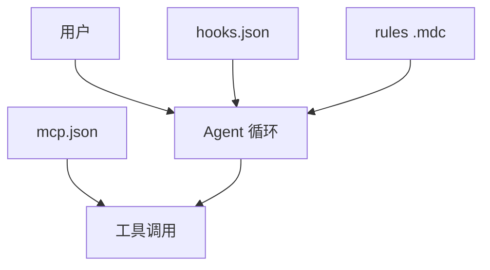

# Cursor 机制总览

> Hooks / Rules / MCP：把脚本、策略、工具接到 Agent 循环。

出处：[Hooks](https://cursor.com/docs/hooks)、[Rules](https://cursor.com/docs/rules)、[MCP](https://cursor.com/docs/mcp)。

---

## 一句话

| 面 | 做什么 |
| --- | --- |
| Hooks | 观察 / 拦截 Agent 阶段 |
| Rules | 注入持久策略 |
| MCP | 提供可调用工具 |

---

## 先读哪个

| 想了解 | 打开 |
| --- | --- |
| Hook 怎么跑、退出码 | [hooks.md](hooks.md) |
| 每个事件能拦 / 能注入什么 | [hook-events.md](hook-events.md) |
| `.mdc` 何时进上下文 | [rules.md](rules.md) |
| `mcp.json` 与传输 | [mcp.md](mcp.md) |
| 项目 / 用户 / 企业路径 | [config.md](config.md) |
| 会话 ID 怎么配对 | [identifiers.md](identifiers.md) |
| IDE / Cloud / CLI 差在哪 | [surfaces.md](surfaces.md) |

---

## 三类扩展面

| 面 | 配置 | 作用 |
| --- | --- | --- |
| Hooks | `hooks.json` | 固定阶段跑脚本：观察、拦截、注入 |
| Rules | `.cursor/rules/*.mdc` | 策略文本载入上下文 |
| MCP | `mcp.json` | 注册外部工具供 Agent 调用 |

---

## 典型落点

| 文件 | 常见路径 |
| --- | --- |
| Hooks | `.cursor/hooks.json` 或 `~/.cursor/hooks.json` |
| MCP | `.cursor/mcp.json` 或 `~/.cursor/mcp.json` |
| Rules | `.cursor/rules/*.mdc` |

路径与优先级 → [config.md](config.md)。IDE / Cloud 差异 → [surfaces.md](surfaces.md)。
