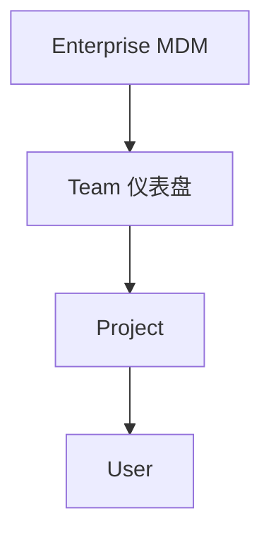

# 配置路径

> Hooks / MCP / Rules 分文件存放；可有项目、用户、企业 / 团队来源。

出处：[Hooks](https://cursor.com/docs/hooks)、[MCP](https://cursor.com/docs/mcp)、[Rules](https://cursor.com/docs/rules)。

---

## 一句话

| 级别 | 跟着谁走 |
| --- | --- |
| 项目 | 仓库 |
| 用户 | 本机 |
| 企业 / 团队 | 集中下发 |

---

## I/O

| 方向 | 内容 |
| --- | --- |
| 输入 | 各路径上的 JSON / `.mdc` |
| 输出 | Cursor 合并后的有效配置 |

---

## 落点一览

| 机制 | 项目级 | 用户级 | 其他 |
| --- | --- | --- | --- |
| Hooks | `.cursor/hooks.json` | `~/.cursor/hooks.json` | Enterprise / Team |
| MCP | `.cursor/mcp.json` | `~/.cursor/mcp.json` | Marketplace 安装项 |
| Rules | `.cursor/rules/*.mdc` | 设置中的 User Rules | Team Rules |

---

## Hooks 优先级

同事件下多来源 Hook 都会跑；响应冲突时高优先级覆盖。

### Enterprise 路径示例

| 系统 | 路径 |
| --- | --- |
| macOS | `/Library/Application Support/Cursor/hooks.json` |
| Linux/WSL | `/etc/cursor/hooks.json` |
| Windows | `C:\ProgramData\Cursor\hooks.json` |

### cwd

| 来源 | 脚本工作目录 |
| --- | --- |
| Project | 项目根 |
| User | `~/.cursor/` |
| Enterprise | 企业配置目录 |
| Team | 托管 hooks 目录 |

---

## MCP 合并

| 规则 | 说明 |
| --- | --- |
| 合并 | 项目 + 用户配置一并加载 |
| 同名 | `mcpServers` 条目：项目级覆盖用户级 |
| Cloud | 通常拿不到本机 `~/.cursor/` |

---

## Rules 范围与优先级

| 来源 | 范围 |
| --- | --- |
| Project `.mdc` | 当前仓库（可版本管理） |
| User Rules | 本机所有项目 |
| Team Rules | 团队成员同步 |

冲突优先级（高 → 低）：Team → Project → User。详见 [rules.md](rules.md)。

---

## 热加载

| 文件 | 常见行为 |
| --- | --- |
| `hooks.json` | 监视变更，通常自动重载 |
| `mcp.json` | 常需 Reload Window / 重启 |
| Rules `.mdc` | 随规则系统加载；多在后续会话生效 |

以当前 Cursor 版本为准。
