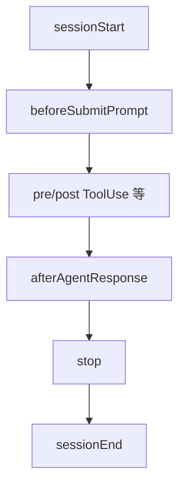

# Hook 事件

> 固定触发点 + 固定 I/O 字段；不是每个事件都能改写 Agent。

出处：[Cursor Hooks — Hook events](https://cursor.com/docs/hooks)。

---

## 一句话

有的可拦截，有的只观察，有的可注入上下文。

---

## 能力速览

| 事件 | 可拦截 | 可注入上下文 | 可改输入 |
| --- | --- | --- | --- |
| `sessionStart` | 否（建会话） | `additional_context` | `env` |
| `beforeSubmitPrompt` | `continue` | 否 | 否 |
| `preToolUse` | `permission` | 否 | `updated_input` |
| `postToolUse` | 否 | `additional_context` | MCP: `updated_mcp_tool_output` |
| `afterAgentResponse` | 否 | 否 | 否 |
| `sessionEnd` | 否 | 否 | 否 |
| `preCompact` | 否 | 否（可 `user_message`） | 否 |
| `stop` | 否 | 否 | follow-up 消息 |

Cloud / IDE 差集 → [surfaces.md](surfaces.md)。下方按事件展开字段。

---

## Agent 生命周期

### `sessionStart`

新 composer 会话创建时。fire-and-forget：agent loop 不阻塞等待。

| | 字段 |
| --- | --- |
| 输入 | `session_id`（同 `conversation_id`）、`is_background_agent`、`composer_mode?` |
| 输出 | `env?`、`additional_context?` |

| 输出 | 作用 |
| --- | --- |
| `env` | 本会话环境变量；后续 Hook 可见 |
| `additional_context` | 写入会话初始系统上下文 |

schema 也接受 `continue` / `user_message`，但当前调用方不强制；`continue:false` 不能阻止建会话。

### `sessionEnd`

会话结束。fire-and-forget；响应只记日志。

| | 字段 |
| --- | --- |
| 输入 | `session_id`、`reason`、`duration_ms`、`is_background_agent`、`final_status`、`error_message?` |
| 输出 | 无 |

`reason`：`completed` / `aborted` / `error` / `window_close` / `user_close`。

---

## 提示与响应

### `beforeSubmitPrompt`

用户发送后、后端请求前。可拦截提交。

| | 字段 |
| --- | --- |
| 输入 | `prompt`、`attachments[]`（`type`: `file` \| `rule`，含 `file_path`） |
| 输出 | `continue`、`user_message?` |

| 输出 | 作用 |
| --- | --- |
| `continue: false` | 阻止提交 |
| `user_message` | 拦截时展示给用户 |

不支持通过输出改写 prompt 正文。

### `afterAgentResponse`

助手最终文本完成后。

| | 字段 |
| --- | --- |
| 输入 | `text` |
| 输出 | 当前无专用字段 |

### `afterAgentThought`

结构化 thinking 块完成后（需 reasoning 模型）。

| | 字段 |
| --- | --- |
| 输入 | `text`、`duration_ms?` |
| 输出 | 无专用字段 |

---

## 工具与执行控制

| 事件 | 时机 | 典型能力 |
| --- | --- | --- |
| `preToolUse` | 任意工具前 | `permission` allow/deny；可选 `updated_input` |
| `postToolUse` | 工具成功后 | 可观察；可带 `additional_context`；MCP 场景可有 `updated_mcp_tool_output` |
| `postToolUseFailure` | 工具失败后 | 观察失败 |
| `beforeShellExecution` / `afterShellExecution` | Shell 前后 | 门控 / 审计 |
| `beforeMCPExecution` / `afterMCPExecution` | MCP 工具前后 | 门控 / 审计 |
| `beforeReadFile` / `afterFileEdit` | 读文件 / 编辑后 | 门控 / 后处理 |
| `subagentStart` / `subagentStop` | Task 子代理 | 生命周期；Stop 可 follow-up |

`preToolUse` 的 `permission:"ask"` 在 schema 中接受，当前不一定强制执行。

---

## 循环结束与压缩

### `stop`

Agent 循环结束。

| | 字段 |
| --- | --- |
| 输入 | `status`（`completed` \| `aborted` \| `error`）、`loop_count` |
| 输出 | `followup_message?` |

非空 `followup_message` 会自动作为下一条用户消息提交。`loop_limit` 默认 **5**（可配置；`null` 取消上限）。

### `preCompact`

上下文压缩前。不能阻止或改写压缩内容；可返回 `user_message` 提示用户。

| 输入要点 | `trigger`、`context_usage_percent`、`context_tokens`、`message_count` 等 |

---

## Tab / App

| 事件 | 面 | 说明 |
| --- | --- | --- |
| `beforeTabFileRead` | Tab | 控制 Tab 读文件 |
| `afterTabFileEdit` | Tab | Tab 编辑后处理 |
| `workspaceOpen` | App | 工作区打开/文件夹变更；可返回额外 plugin 路径 |
