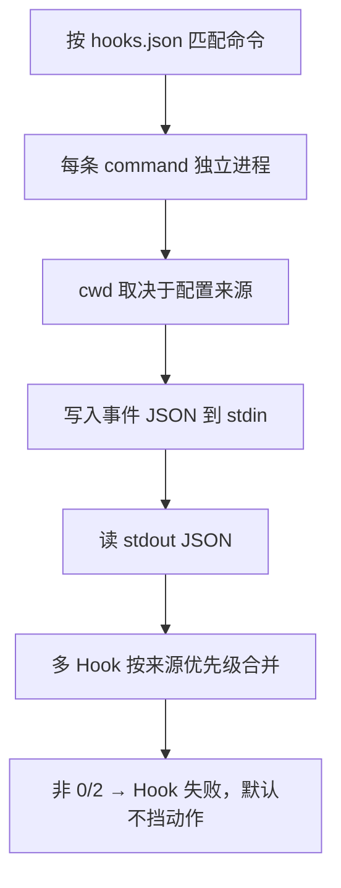

# Hooks 运行时

> 子进程：stdin 收 JSON，stdout 回 JSON，退出码定成败语义。

出处：[Cursor Hooks](https://cursor.com/docs/hooks)。

---

## 一句话

在 Agent（或 Tab / App）固定阶段跑脚本 → 观察、拦截，或改写部分行为。

---

## I/O

| 方向 | 内容 |
| --- | --- |
| 输入 | stdin：公共字段 + 事件专用字段 |
| 输出 | stdout：该事件允许的 JSON 字段 |
| 退出码 | `0` 成功；`2` 拒绝动作；其他默认 fail-open |

---

## 进程模型



可选：`timeout`、`matcher`（按事件相关字符串过滤）。

cwd 细节 → [config.md](config.md)。

---

## 公共输入字段

Agent 类 Hook 通常带有：

| 字段 | 含义 |
| --- | --- |
| `conversation_id` | 跨多轮稳定的会话 ID |
| `generation_id` | 每条用户消息变化 |
| `hook_event_name` | 当前事件名 |
| `cursor_version` | Cursor 版本 |
| `workspace_roots` | 工作区根路径列表 |
| `model` / `model_id` / `model_params` | 模型与参数 |
| `user_email` | 可选 |
| `transcript_path` | 可选；主会话 transcript 路径 |

App 生命周期 Hook（如 `workspaceOpen`）不在 Agent 会话内，会省略 `conversation_id`、`generation_id`、`model`、`session_id`、`transcript_path`。

---

## 配置骨架

| 来源 | 路径 | 脚本 cwd |
| --- | --- | --- |
| Project | `<repo>/.cursor/hooks.json` | 项目根 |
| User | `~/.cursor/hooks.json` | `~/.cursor/` |
| Enterprise | 系统级路径 | 企业配置目录 |
| Team | 仪表盘下发 | 托管目录 |

优先级：Enterprise → Team → Project → User。监视文件变更后热加载。

路径约定：

| 级别 | 写法 |
| --- | --- |
| 用户级 | cwd = `~/.cursor/`，可用 `./hooks/...` |
| 项目级 | 相对**项目根**，如 `.cursor/hooks/init.sh`（不是 `./hooks/x.sh`） |

```json
{
  "version": 1,
  "hooks": {
    "sessionStart": [{ "command": ".cursor/hooks/init.sh", "timeout": 30 }],
    "beforeSubmitPrompt": [{ "command": ".cursor/hooks/audit.sh" }],
    "afterAgentResponse": [{ "command": ".cursor/hooks/log.sh" }],
    "sessionEnd": [{ "command": ".cursor/hooks/cleanup.sh" }]
  }
}
```

---

## 退出码

| 退出码 | 行为 |
| --- | --- |
| `0` | 成功，使用 stdout JSON |
| `2` | 拒绝当前动作（等价 deny） |
| 其他 | Hook 失败；动作默认继续（fail-open） |

可设 `failClosed: true`：非成功退出时改为拦截，而不是放行。

---

## 两种执行类型

| 类型 | 说明 |
| --- | --- |
| Command（默认） | 本地 shell/脚本；Cloud 可用 |
| Prompt | 用 LLM 评估自然语言条件；Cloud 不可用 |

---

## 三大触发面

| 类别 | 何时触发 |
| --- | --- |
| Agent Hooks | Cmd+K / Agent Chat |
| Tab Hooks | 行内 Tab 补全 |
| App Hooks | 工作区生命周期（如 `workspaceOpen`） |

事件清单与字段 → [hook-events.md](hook-events.md)。
