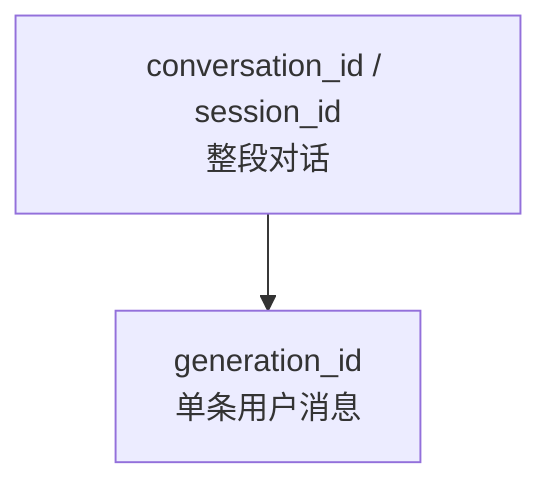

# 会话与轮次标识

> Hook 载荷里的会话 / 单轮 ID，供外部脚本关联多事件。

出处：[Cursor Hooks — Common schema](https://cursor.com/docs/hooks)。

---

## 一句话

| 字段 | 变不变 |
| --- | --- |
| `conversation_id` | 跨轮稳定 |
| `generation_id` | 每条用户消息一变 |
| `session_id` | lifecycle 用；等同 `conversation_id` |



---

## I/O

| 方向 | 内容 |
| --- | --- |
| 输入 | Hook JSON 中的标识字段 |
| 输出 | 无（标识由 Cursor 生成并下发） |

---

## 字段

| 字段 | 语义 |
| --- | --- |
| `conversation_id` | 同一 composer 对话跨多轮不变 |
| `generation_id` | 用户每发一条消息就变化 |
| `session_id` | `sessionStart` / `sessionEnd` 使用；与 `conversation_id` 同一标识 |

| 场景 | 有没有这些字段 |
| --- | --- |
| Agent 类 Hook 公共 schema | 含 `conversation_id` 与 `generation_id` |
| App Hook（如 `workspaceOpen`） | 不在会话内，通常没有 |

---

## 配对含义

```text
同一轮用户消息
  = 相同 conversation_id
  + 相同 generation_id
```

| 场景 | 用法 |
| --- | --- |
| 跨 Hook 关联 before / after | 用双键对齐 |
| 区分并发两轮 | 靠不同 `generation_id` |
| 会话级状态 | 只用 `conversation_id` / `session_id` |

---

## 相关可选字段

| 字段 | 说明 |
| --- | --- |
| `transcript_path` | 主会话 transcript 文件路径；可为 null；格式稳定性以官方为准 |
| `workspace_roots` | 工作区根；多根工作区可有多项 |
| `parent_conversation_id` | 子代理等场景下指向父会话（见对应事件文档） |

---

## 与模型字段

同一公共载荷还可含：

| 字段 | 说明 |
| --- | --- |
| `model` | 遗留 slug |
| `model_id` | 结构化模型 ID |
| `model_params` | 如 thinking / context / effort |
