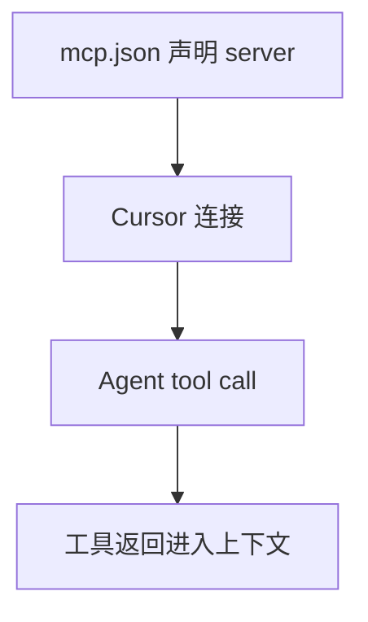

# MCP

> Model Context Protocol：把外部工具注册给 Cursor Agent。

出处：[Cursor MCP](https://cursor.com/docs/mcp)。

---

## 一句话

在 `mcp.json` 声明 server → Cursor 连接后，Agent 按需调用其工具。



---

## I/O

| 方向 | 内容 |
| --- | --- |
| 配置输入 | `.cursor/mcp.json` / `~/.cursor/mcp.json` |
| 运行时输入 | Agent 发起的 tool call |
| 输出 | 工具返回内容进入 Agent 上下文 |

---

## 配置

项目与用户配置合并；同名 server 时**项目级优先**。

### stdio（本地）

```json
{
  "mcpServers": {
    "example": {
      "command": "npx",
      "args": ["-y", "some-mcp-server"],
      "env": {
        "API_KEY": "${env:API_KEY}"
      }
    }
  }
}
```

| 字段 | 含义 |
| --- | --- |
| `command` | 可执行文件 |
| `args` | 参数 |
| `env` / `envFile` | 环境变量（`envFile` 主要用于 stdio） |

Cursor 把 server 当本地子进程拉起，用 stdin/stdout 交换 MCP 消息。

| 要求 | 说明 |
| --- | --- |
| 可执行文件 | 可用 |
| 启动 | 不立刻崩溃 |
| stdout | **只走协议**（日志勿污染 stdout） |

### 远程

```json
{
  "mcpServers": {
    "remote": {
      "url": "https://mcp.example.com/sse",
      "headers": {
        "Authorization": "Bearer …"
      }
    }
  }
}
```

| 项 | 说明 |
| --- | --- |
| 官方传输 | stdio、SSE、Streamable HTTP |
| 远程写法 | `url` + 可选 `headers` |

---

## 变量替换

可在 `command`、`args`、`env`、`url`、`headers` 中使用：

| 变量 | 含义 |
| --- | --- |
| `${env:NAME}` | 环境变量 |
| `${userHome}` | 用户主目录 |
| `${workspaceFolder}` | 含 `.cursor/mcp.json` 的项目根 |
| `${workspaceFolderBasename}` | 项目根目录名 |
| `${pathSeparator}` / `${/}` | 路径分隔符 |

---

## 发现与安装

| 方式 | 说明 |
| --- | --- |
| 手写 `mcp.json` | 项目或用户级 |
| Customize / Marketplace | 一键安装官方插件 |
| 设置里 MCP 面板 | 查看连接状态 |

改配置后通常需要 Reload Window 或重启才能生效。

---

## 与 Hooks 的交汇

| Hook | 作用 |
| --- | --- |
| `beforeMCPExecution` | MCP 工具调用前可门控 |
| `afterMCPExecution` | 调用后可审计 |

| 机制 | 负责 |
| --- | --- |
| MCP | 有哪些工具 |
| 上述 Hook | 这次调用是否放行 / 如何记录 |
