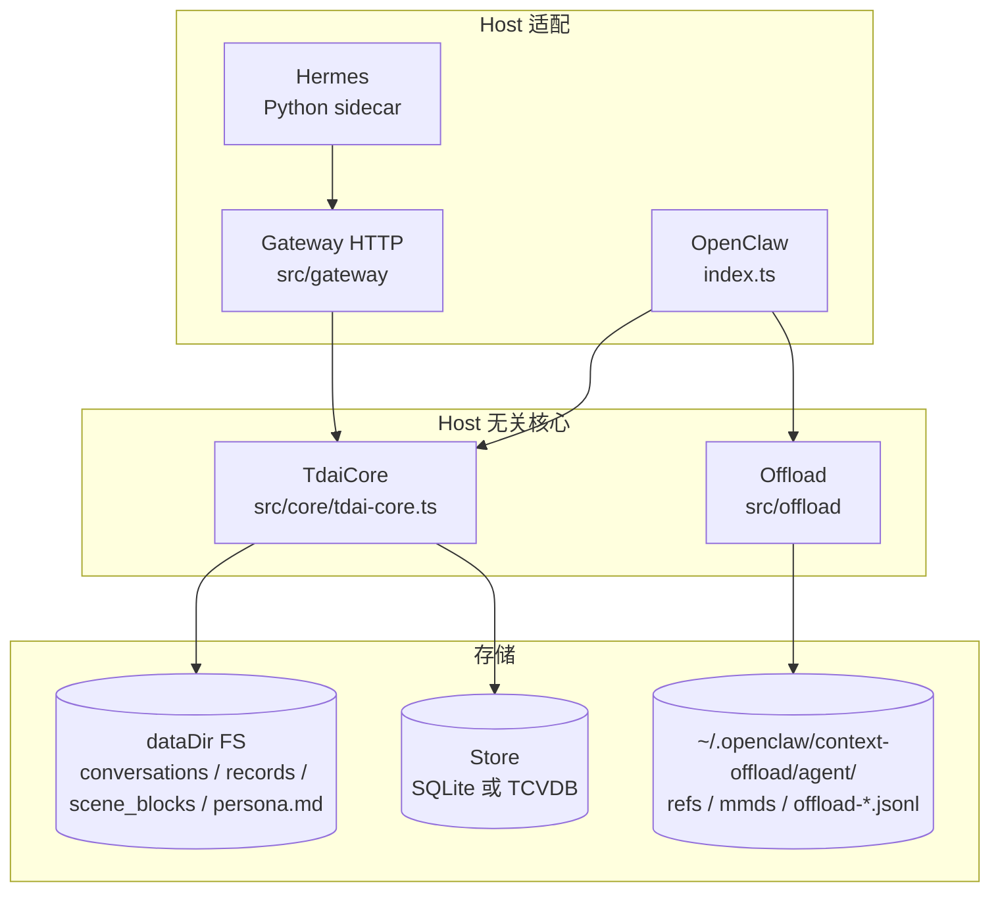
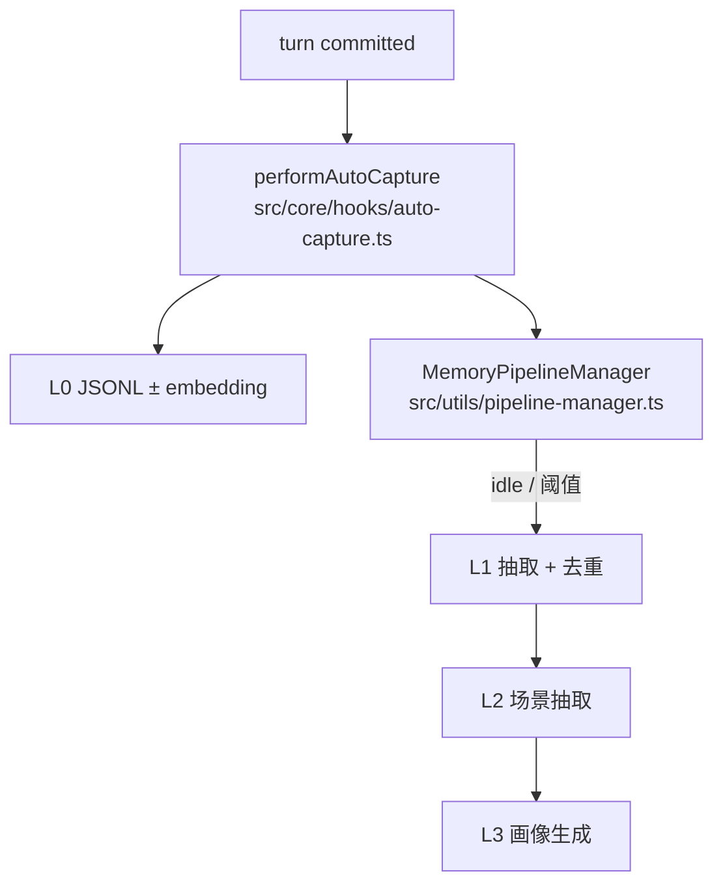
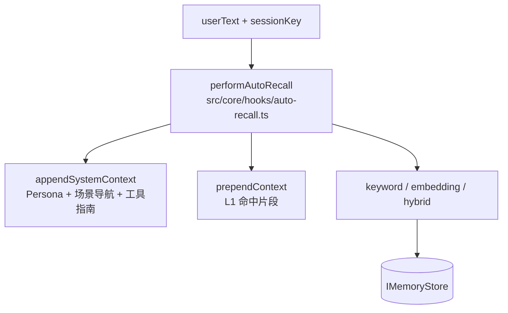
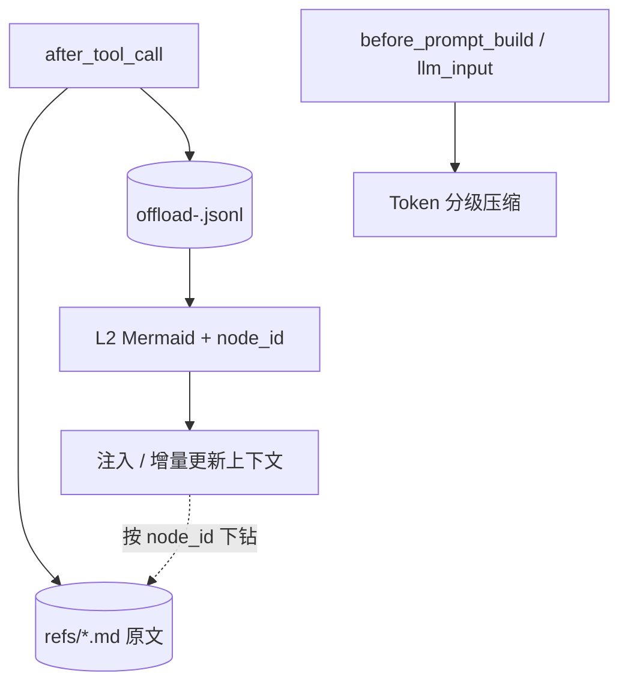
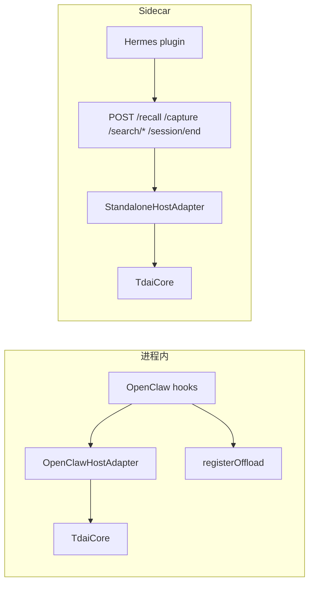

# 开发者架构总览

> **一句话**：分层长期记忆（L0→L3）+ 符号化短期卸载（Offload）；业务在 Host 无关的 `TdaiCore`，宿主只做事件翻译。

改代码时：先扫总图 → 再按「改哪里」跳目录地图。产品叙事见 [README_CN.md](../../README_CN.md)；Cursor 适配见 [docs/spec.md](../spec.md)。

---

## 1. 总架构

三块：**Host 适配**（译事件）→ **TdaiCore / Offload**（业务）→ **FS / Store**（落盘）。



| 层 | 职责 | 入口 |
|---|---|---|
| Host 适配 | 宿主事件 → Core / Offload 调用 | `src/adapters/*`、`index.ts`、Hermes plugin |
| Gateway | HTTP 暴露 Core（sidecar） | `src/gateway/server.ts` |
| TdaiCore | 长期记忆：召回、捕获、检索、Pipeline | `src/core/tdai-core.ts` |
| Offload | 短期：工具原文卸载、Mermaid 画布、上下文压缩 | `src/offload/index.ts`（仅 OpenClaw） |
| Store / FS | 低层证据 + 高层可读结构 | `src/core/store/*`、`initDataDirectories` |

**边界**：对外 API 经 `HostAdapter` / `LLMRunner`（`src/core/types.ts`）。实现上可注入 `StandaloneLLMRunnerFactory` 覆盖 LLM，不依赖 OpenClaw API。

---

## 2. 长期记忆（L0 → L3）

低层留证据，高层留结构；高层均可沿索引下钻回原文。

| 层 | 存什么 | 典型位置 |
|---|---|---|
| L0 Conversation | 原始对话轮次 | `dataDir/conversations/*.jsonl` + 可选向量 |
| L1 Atom | 结构化事实 | Store + `dataDir/records/` |
| L2 Scenario | 场景块 + 导航 | `dataDir/scene_blocks/`、`persona.md` 尾部导航 |
| L3 Persona | 用户画像 | `dataDir/persona.md`（生成逻辑 `src/core/persona/*`） |

### Capture（写入）

turn 提交后先落 L0，再异步调度 L1→L3（本钩子内不同步跑完）。



| 项 | 说明 |
|---|---|
| 入口 | `TdaiCore.handleTurnCommitted` ← OpenClaw `agent_end` / Gateway `POST /capture` |
| 输入 | `CompletedTurn`（messages、sessionKey、可选原始 userText） |
| 输出 | L0 落盘；通知 scheduler；不在此同步跑完 L1–L3 |
| 出处 | `src/core/tdai-core.ts`、`src/core/hooks/auto-capture.ts`、`src/utils/pipeline-factory.ts` |

### Recall（召回）

按 userText 拼上下文：动态 L1 前置 + Persona/导航/工具指南后置；Gateway 只透传后者。



| 项 | 说明 |
|---|---|
| 入口 | `TdaiCore.handleBeforeRecall` ← OpenClaw `before_prompt_build` / Gateway `POST /recall` |
| 输入 | userText、sessionKey、dataDir、store |
| 输出（Core） | `prependContext?`（L1 动态段）、`appendSystemContext?`（Persona + 场景导航 + 工具指南） |
| Gateway 差异 | `POST /recall` **只回** `appendSystemContext`（字段名 `context`）；L1 `prependContext` 不经 HTTP 透传 |
| 主动加深 | `tdai_memory_search`（L1）、`tdai_conversation_search`（L0）、`read_file`（场景路径） |
| 出处 | `src/core/hooks/auto-recall.ts`；Gateway 裁剪见 `src/gateway/server.ts` |

### Session / 隔离（易踩坑）

| 点 | 语义 |
|---|---|
| `handleSessionEnd(sessionKey)` | **只** flush 该会话缓冲；进程继续服务其他会话 |
| `destroy()` | 进程退出：拆 scheduler / store / embedding |
| `actorId` | Core 召回硬编码 `"default_user"`（`tdai-core.ts`）；隔离边界是 **dataDir**，不是 user 字段 |

出处：`src/core/tdai-core.ts`（`handleSessionEnd` / `handleBeforeRecall`）。

---

## 3. 短期 Offload（符号化上下文）

与长期记忆的 L1/L2/L3 **同名不同物**：管单次长任务上下文，不进 TdaiCore Pipeline。



| Offload 层 | 作用 | 关键代码 |
|---|---|---|
| refs | 完整工具结果落盘 | `src/offload/storage.ts`、`hooks/after-tool-call.ts` |
| jsonl | 步骤摘要（L1 / L1.5） | `storage.ts`、`local-llm/`、`backend-client.ts` |
| Mermaid | 任务画布 | `pipelines/l2-mermaid.ts`、`mmd-injector.ts` |
| L3 compress | mild / aggressive / emergency 压 token | `hooks/llm-input-l3.ts`、`before-prompt-build.ts` |

| 项 | 说明 |
|---|---|
| 入口 | `registerOffload(api, config)`（`src/offload/index.ts`），由 `index.ts` 条件注册 |
| 默认布局 | `~/.openclaw/context-offload/<agent>/{refs,mmds,offload-<session>.jsonl,state.json}` |
| 输入 | 宿主 hook 事件（tool 结果、messages、prompt） |
| 输出 | 改写后的 messages / 注入的 MMD；refs 可溯源 |

---

## 4. Host 与 Gateway

OpenClaw 进程内直调；Hermes / Cursor 经 Gateway HTTP 调 Core。



| Host | 适配器 | 长期记忆 | Offload |
|---|---|---|---|
| OpenClaw | `src/adapters/openclaw/` | 进程内 `TdaiCore` | 同进程 hooks（唯一接入） |
| Hermes | Gateway + `standalone/` | HTTP → Core | **未接入** |
| Cursor | 薄 hook → Gateway | 见 `docs/spec.md` | v1 非目标 |

Gateway 路由（`src/gateway/server.ts`）：

| 方法 | 路径 | Core 映射 |
|---|---|---|
| GET | `/health` | 探活 |
| POST | `/recall` | `handleBeforeRecall`（仅 `appendSystemContext` → `context`） |
| POST | `/capture` | `handleTurnCommitted` |
| POST | `/search/memories` | `searchMemories` |
| POST | `/search/conversations` | `searchConversations` |
| POST | `/session/end` | `handleSessionEnd` |
| POST | `/seed` | `core/seed` 批导入 |

---

## 5. 目录地图（改哪里）

| 你想… | 去看 |
|---|---|
| 挂 OpenClaw 插件 / 注册 hook | `index.ts` |
| 改召回策略或注入格式 | `src/core/hooks/auto-recall.ts` |
| 改 L0 写入 / checkpoint | `src/core/hooks/auto-capture.ts`、`src/core/conversation/l0-recorder.ts` |
| 改 L1 抽取 / 去重 | `src/core/record/*`、`src/core/prompts/l1-*` |
| 改场景 / 画像 | `src/core/scene/*`、`src/core/persona/*` |
| 改检索工具文案 | `src/core/tools/*` |
| 换存储后端 | `src/core/store/factory.ts`（`sqlite` \| `tcvdb`） |
| 调 Pipeline 定时语义 | `src/utils/pipeline-manager.ts`、`pipeline-factory.ts` |
| 改 Offload 压缩阈值 | `src/offload/hooks/*`、`types.ts` 默认值 |
| 改 Mermaid 生成 | `src/offload/pipelines/l2-mermaid.ts` |
| 加 HTTP 能力 | `src/gateway/server.ts` + `types.ts` |
| 接新宿主 | 实现 `HostAdapter` + `LLMRunnerFactory`（参考 `adapters/standalone/`） |
| CLI / seed | `src/cli/`、`src/core/seed/` |

dataDir 子目录（`initDataDirectories`）：

```
conversations/   # L0
records/         # L1 侧车文件
scene_blocks/    # L2
.metadata/       # checkpoint 等
.backup/
```

---

## 6. 扩展点（最短路径）

1. **新 Host**：实现 `HostAdapter`（`src/core/types.ts`）→ 组装 `TdaiCore` → 映射生命周期到 `handleBeforeRecall` / `handleTurnCommitted` / `handleSessionEnd` / `destroy`。
2. **新 Store**：实现 `IMemoryStore` → 在 `createStoreBundle` 增加 `storeBackend` 分支。
3. **新检索工具**：在 `src/core/tools/` 实现 → OpenClaw 于 `index.ts` 注册；Gateway 加路由并转调 Core。
4. **Offload 新压缩策略**：改 `hooks/llm-input-l3.ts` 阈值链；保持 `node_id` ↔ refs 可下钻。

---

## 7. 相关文档

| 文档 | 用途 |
|---|---|
| [README_CN.md](../../README_CN.md) | 产品与效果 |
| [docs/spec.md](../spec.md) | Cursor Adapter |
| [src/cli/README.md](../../src/cli/README.md) | CLI |
| [hermes-plugin/.../README.md](../../hermes-plugin/memory/memory_tencentdb/README.md) | Hermes 侧插件 |
| [CONTRIBUTING_CN.md](../../CONTRIBUTING_CN.md) | 贡献流程 |
