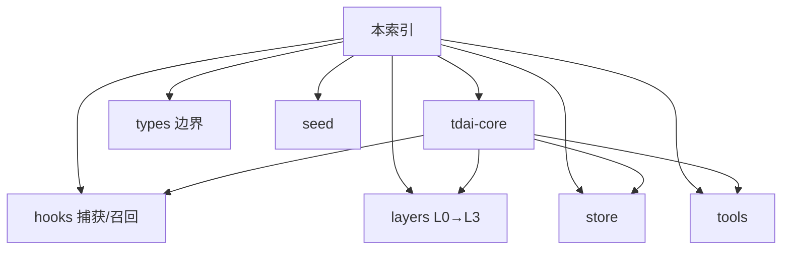

# Core 模块索引

> **一句话**：长期记忆实现都在 `src/core`；入口是 `TdaiCore`，宿主只负责把事件翻译成 Core 调用。

总架构见 [../architecture.md](../architecture.md)。本目录按模块拆篇，改代码时按「想改什么」跳转。

---

## 怎么读

| 你想… | 读 |
|---|---|
| 接宿主 / 生命周期 | [tdai-core.md](tdai-core.md) |
| 看 Host 契约 | [types.md](types.md) |
| 改写入或注入时机 | [hooks.md](hooks.md) |
| 改 L0/L1/L2/L3 内容形态 | [layers.md](layers.md) |
| 换 SQLite / TCVDB / embedding | [store.md](store.md) |
| 改 Agent 主动检索工具 | [tools.md](tools.md) |
| 批导入历史对话 | [seed.md](seed.md) |

---

## 模块一览

| 文档 | 目录 / 入口 | 职责 |
|---|---|---|
| [tdai-core](tdai-core.md) | `src/core/tdai-core.ts` | 门面：召回、捕获、检索、Pipeline 装配、销毁 |
| [types](types.md) | `src/core/types.ts` | `HostAdapter` / `LLMRunner` / turn 与结果类型 |
| [hooks](hooks.md) | `src/core/hooks/` | `performAutoCapture` / `performAutoRecall` |
| [layers](layers.md) | `conversation` / `record` / `scene` / `persona` | L0→L3 分层实现 |
| [store](store.md) | `src/core/store/` | `IMemoryStore` + Embedding |
| [tools](tools.md) | `src/core/tools/` | `tdai_memory_search` / `tdai_conversation_search` |
| [seed](seed.md) | `src/core/seed/` | CLI/Gateway 批导入编排 |

**边界**：Core 只依赖 `HostAdapter` / `LLMRunner`（见 [types.md](types.md)），不 import OpenClaw / Hermes 具体 API。适配器在 `src/adapters/`。

---

## 相关

| 文档 | 用途 |
|---|---|
| [../architecture.md](../architecture.md) | 全仓开发者总览（含 Offload / Gateway） |
| [../../spec.md](../../spec.md) | Cursor Adapter |
| [../../../README_CN.md](../../../README_CN.md) | 产品叙事 |
