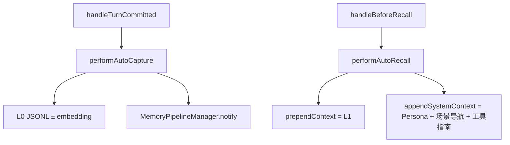

# Hooks：捕获与召回

> **一句话**：turn 结束后写 L0 并通知 Pipeline；下一轮 prompt 前注入 Persona / 场景导航 / L1 片段。

出处：[`src/core/hooks/auto-capture.ts`](../../../src/core/hooks/auto-capture.ts)、[`auto-recall.ts`](../../../src/core/hooks/auto-recall.ts)。索引：[INDEX.md](INDEX.md)。

---

## 总览

| | Capture | Recall |
|---|---|---|
| **入口** | `TdaiCore.handleTurnCommitted` | `TdaiCore.handleBeforeRecall` |
| **是否跑 L1–L3** | 否，只通知 scheduler | 否，只读已有记忆 |

---

## Capture — I/O

| 输入 | 说明 |
|---|---|
| `messages` / `sessionKey` / `sessionId?` | 本轮消息 |
| `cfg` / `pluginDataDir` | 配置与落盘根 |
| `scheduler?` | Pipeline 通知 |
| `originalUserText?` / `originalUserMessageCount?` | 去掉 prepend 污染后的原文定位 |
| `pluginStartTimestamp?` | 无 checkpoint 时的游标兜底 |
| `vectorStore?` / `embeddingService?` | 可选 L0 向量 |
| `bgTaskRegistry?` | 登记延迟 embedding，供 `destroy` drain |

| 输出（`AutoCaptureResult` / `CaptureResult`） | 说明 |
|---|---|
| `l0RecordedCount` | 写入 JSONL 的条数 |
| `l0VectorsWritten` | 向量条数 |
| `schedulerNotified` | 是否已 `notify` |
| `filteredMessages` | 过滤后消息 |

**设计要点**（文件头注释）：

- 始终本地写 L0（`l0-recorder`）
- 有 Store+Embedding 时再写 L0 向量
- **不在此触发抽取**；由 Pipeline 决定时机
- L0 与 checkpoint 在 `captureAtomically` 内同锁，防并发重复写

---

## Recall — I/O

| 输入 | 说明 |
|---|---|
| `userText` / `actorId` / `sessionKey` | 查询与作用域 |
| `cfg` / `pluginDataDir` | 策略与 persona/scene 路径 |
| `vectorStore?` / `embeddingService?` | 检索后端 |

| 输出（`RecallResult`） | 说明 |
|---|---|
| `prependContext?` | L1 命中，拼到用户侧 |
| `appendSystemContext?` | Persona + 场景导航 + `<memory-tools-guide>` |
| `recalledL1Memories?` 等 | 指标 |

| 策略（`cfg.recall`） | 行为 |
|---|---|
| `keyword` | FTS5 BM25；不可用则空 |
| `embedding` | 向量相似 |
| `hybrid` | 两者 RRF 合并 |

超时：`cfg.recall.timeoutMs`（默认 5s）内未完成则跳过注入，避免挡用户。

---

## Session 对照

| 调用 | 语义 |
|---|---|
| `handleSessionEnd` | 只 flush 该会话（见 [tdai-core.md](tdai-core.md)） |
| `destroy` | 进程级拆除 |

---

## 改哪里

| 目标 | 位置 |
|---|---|
| L0 过滤 / JSONL 格式 | `conversation/l0-recorder.ts` → [layers.md](layers.md) |
| 注入文案 / 截断 | `auto-recall.ts` |
| 场景导航内容 | `scene/scene-navigation.ts` |
| 检索后端能力 | [store.md](store.md) |
