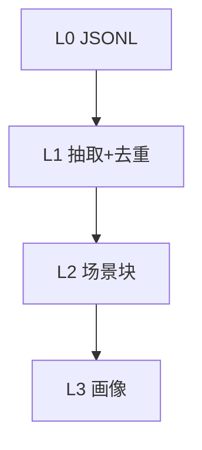

# Layers：L0 → L3

> **一句话**：低层留证据，高层留结构；均可沿索引下钻回原文。

索引：[INDEX.md](INDEX.md)。调度由 `MemoryPipelineManager`（`src/utils/pipeline-manager.ts`）触发；本篇只写 Core 内各层实现。

---

## 总览

| 层 | 存什么 | 目录 / 模块 |
|---|---|---|
| L0 Conversation | 原始轮次 | `dataDir/conversations/*.jsonl` → `conversation/` |
| L1 Atom | 结构化事实 | Store + `dataDir/records/` → `record/` |
| L2 Scenario | 场景块 + 导航 | `dataDir/scene_blocks/` → `scene/` |
| L3 Persona | 用户画像 | persona 文件 → `persona/` |

---

## L0 — conversation

出处：[`l0-recorder.ts`](../../../src/core/conversation/l0-recorder.ts)。

| | |
|---|---|
| **输入** | hook 传来的 messages；可选干净 `originalUserText` |
| **输出** | 按日 JSONL（一行一条消息：`sessionKey`、role、content、timestamp…） |
| **要点** | sanitize 防反馈环；过滤短/命令噪声；与系统 session 文件解耦 |

由 [hooks Capture](hooks.md) 调用；可选再写 Store 中的 L0 向量。

---

## L1 — record

出处：[`l1-extractor.ts`](../../../src/core/record/l1-extractor.ts)、`l1-dedup.ts`、`l1-writer.ts`、`l1-reader.ts`；prompt：`prompts/l1-*`。

| | |
|---|---|
| **输入** | L0 消息（Store 优先，JSONL 兜底） |
| **输出** | 结构化 `MemoryRecord` → Store + `records/`；去重决策 |
| **LLM** | 单次 JSON 抽取（`enableTools: false`）+ batch 冲突检测 |

| I/O 字段（抽取结果） | 说明 |
|---|---|
| `success` / `extractedCount` | 是否成功、条数 |
| 场景分段 `scene_name` + memories | 内容、type、priority、source_message_ids |

---

## L2 — scene

出处：[`scene-extractor.ts`](../../../src/core/scene/scene-extractor.ts)、`scene-index.ts`、`scene-navigation.ts`、`scene-format.ts`。

| | |
|---|---|
| **输入** | 新 L1 记忆 + 现有 scene index |
| **输出** | `scene_blocks/*.md`；同步 index；更新 persona 尾部导航 |
| **LLM** | `enableTools: true`，workspace 沙箱在 `scene_blocks/` |

召回时注入的是导航摘要，不是整块场景；下钻靠 `read_file` 路径。

---

## L3 — persona

出处：[`persona-generator.ts`](../../../src/core/persona/persona-generator.ts)、`persona-trigger.ts`；prompt：`prompts/persona-generation.ts`。

| | |
|---|---|
| **输入** | 场景索引 / 导航上下文 + 既有 persona |
| **输出** | `dataDir/persona.md`（正文）；场景导航由 L2 维护 |
| **LLM** | `enableTools: true`（四层深扫模型） |

召回时整段（或配置裁剪后）进入 `appendSystemContext`。

---

## Pipeline 接线（谁调用谁）

| 步骤 | 谁 | 出处 |
|---|---|---|
| Capture 通知 | `performAutoCapture` → scheduler | [hooks.md](hooks.md) |
| Wire runners | `TdaiCore.wirePipelineRunners` | [tdai-core.md](tdai-core.md) |
| 工厂 | `createL1Runner` / `L2` / `L3` / persister | `src/utils/pipeline-factory.ts` |

批导入同步跑多层见 [seed.md](seed.md)。

---

## 改哪里

| 目标 | 位置 |
|---|---|
| L0 过滤规则 | `utils/sanitize.ts`、`l0-recorder.ts` |
| L1 schema / 去重 | `record/*`、`prompts/l1-*` |
| 场景文件格式 / 导航 | `scene/*` |
| 画像触发条件 | `persona/persona-trigger.ts` |
| 定时与 idle 阈值 | `src/utils/pipeline-manager.ts` |
