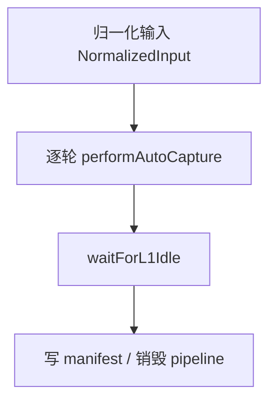

# Seed：批导入

> **一句话**：把历史对话同步跑进 L0→L1（及后续 Pipeline），供 CLI / Gateway `/seed` 使用。

出处：[`src/core/seed/`](../../../src/core/seed/)。索引：[INDEX.md](INDEX.md)。

---

## 职责

| 做 | 不做 |
|---|---|
| 规范化输入、按轮 `performAutoCapture`、进度与 manifest | 替代在线 Host 的 hook 路径 |
| 复用 `pipeline-factory` 的 store / L1–L3 runners | 长期常驻服务（跑完即销毁 pipeline） |

---

## I/O

主入口：`executeSeed(input, opts)`（`seed-runtime.ts`）。

| 输入 | 说明 |
|---|---|
| `NormalizedInput` | `sessions` → `rounds` → `messages`；含 `totalRounds` / `totalMessages`（由 `seed/input.ts` 从 Format A/B/JSONL 校验归一化） |
| `SeedRuntimeOptions` | `outputDir`、`openclawConfig`、`pluginConfig?`、`inputFile?`、logger / 进度回调 |

| 输出 | 说明 |
|---|---|
| `SeedSummary` | `sessionsProcessed` / `roundsProcessed` / `messagesProcessed` / `l0RecordedCount` / `durationMs` / `outputDir` |
| 进度事件 `SeedProgress` | 可观测性 |
| dataDir 产物 | 与在线路径同结构的 L0/L1/… |

错误走日志 / 抛错；**不**进 `SeedSummary` 字段。

---

## 已知限制

**坑（代码 FIXME）**：销毁前主要等 **L1 idle**；L2/L3 可能还在跑 → 产物未必含最新场景/画像。等 pipeline-manager 暴露完整 idle 信号后再补。

---

## 改哪里

| 目标 | 位置 |
|---|---|
| 输入格式 | `seed/input.ts`、`types.ts` |
| 编排 / Ctrl+C | `seed-runtime.ts` |
| CLI 包装 | `src/cli/` |
| Gateway 批导 | `POST /seed` → `src/gateway` + seed |
| 抽取算法本身 | [layers.md](layers.md) |
