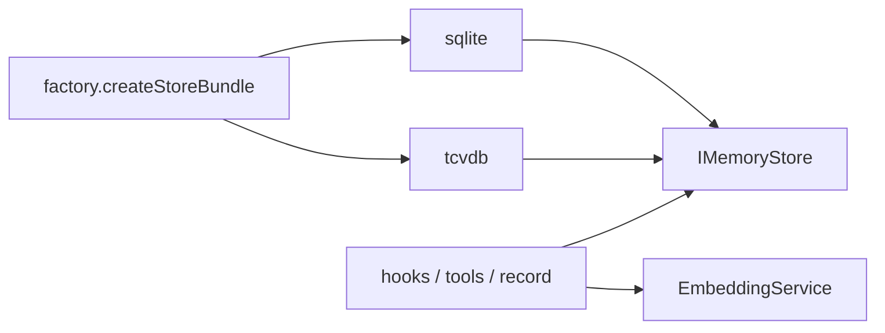

# Store

> **一句话**：后端无关的记忆存储契约；上层只认 `IMemoryStore` + `EmbeddingService`。

出处：[`src/core/store/`](../../../src/core/store/)。索引：[INDEX.md](INDEX.md)。

---

## 职责

| 做 | 不做 |
|---|---|
| L0/L1 读写、向量/FTS/hybrid 检索 | 决定何时抽取（Pipeline） |
| 能力标志降级（无 FTS / 无 embedding） | 依赖具体宿主 |

原则（`store/types.ts`）：

| 原则 | 白话 |
|---|---|
| 后端无关 | 上层只认 `IMemoryStore` |
| 能力制 | 有 FTS/向量才用，没有就降级 |
| 失败 | 多返回空，少抛错 |
| 签名 | 偏 sync，兼容 SQLite |

---

## I/O

### 初始化

| 输入 | 输出 |
|---|---|
| `MemoryTdaiConfig`、`dataDir`、logger | `{ vectorStore?, embeddingService? }`（经 `initStores` / factory） |

`storeBackend`：`sqlite` \| `tcvdb`（见 `factory.ts`）。

### 典型能力（接口级）

| 方向 | 操作 |
|---|---|
| L1 写 | upsert 结构化记忆 + 可选向量 |
| L1 读 | 按 filter 查询；vector / FTS / hybrid 搜索 |
| L0 写 | 消息记录 + embedding（可延迟 `updateL0Embedding`） |
| L0 读 | 向量检索原始对话 |

结果形状见 `L1SearchResult` / `L0SearchResult` 等（`store/types.ts`）。

### EmbeddingService

| 输入 | 输出 |
|---|---|
| 文本（及可选调用选项） | 向量；供写入与查询 |

配置来自 `cfg.embedding`；未配置时检索降级到纯 FTS/空。

---

## 谁在用

| 调用方 | 用途 |
|---|---|
| [hooks](hooks.md) Capture | L0 向量 |
| [hooks](hooks.md) Recall | L1 检索 |
| [layers](layers.md) L1 | 读 L0、写 L1、去重检索 |
| [tools](tools.md) | Agent 主动搜 L1/L0 |

Store 初始化失败时：`TdaiCore` 打 warn，召回/去重降级；Pipeline runners 仍可 JSONL 兜底。

---

## 改哪里

| 目标 | 位置 |
|---|---|
| 新后端 | 实现 `IMemoryStore` → `factory` 加分支 |
| 本地 FTS/BM25 | `sqlite.ts`、`bm25-*.ts` |
| 云向量 | `tcvdb.ts`、`tcvdb-client.ts` |
| Embedding 厂商 | `embedding.ts` + config |
