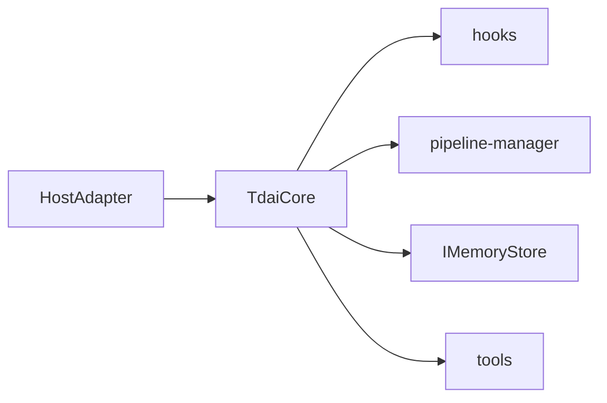

# TdaiCore

> **一句话**：宿主无关的记忆能力门面；OpenClaw 与 Gateway 都经此调用召回、捕获、检索与 Pipeline。

出处：[`src/core/tdai-core.ts`](../../../src/core/tdai-core.ts)。索引：[INDEX.md](INDEX.md)。

---

## 职责

| 做 | 不做 |
|---|---|
| 装配 dataDir / Store / Pipeline | 解析宿主事件（交给 Adapter） |
| 暴露统一生命周期 API | Offload 短期上下文（`src/offload`） |
| 并发安全地启动 scheduler | 实现具体 L1/L2/L3 算法（委托 runners） |

---

## I/O

### 构造

| 输入 | 说明 |
|---|---|
| `hostAdapter` | `HostAdapter`：dataDir、logger、LLM factory |
| `config` | `MemoryTdaiConfig` |
| `sessionFilter?` | 排除内部/压测会话 |
| `instanceId?` | 指标上报 |

### 生命周期

| 方法 | 输入 | 输出 / 副作用 |
|---|---|---|
| `initialize()` | — | 建目录；异步 init store；若 extraction 开启则建 scheduler 并 wire runners |
| `destroy()` | — | 若 scheduler 已 start → `scheduler.destroy()` → drain 后台任务（≤5s）→ close store/embedding → `resetStores` |

### 主能力

| 方法 | 输入 | 输出 | 宿主映射 |
|---|---|---|---|
| `handleBeforeRecall` | `userText`, `sessionKey` | `RecallResult`（可空对象） | OpenClaw `before_prompt_build` / Gateway `POST /recall` |
| `handleTurnCommitted` | `CompletedTurn` | `CaptureResult` | OpenClaw `agent_end` / Gateway `POST /capture` |
| `handleSessionEnd` | `sessionKey` | 只 flush 该会话 | Hermes `on_session_end` / `POST /session/end` |
| `searchMemories` | `MemorySearchParams` | `{ text, total, strategy }` | 工具 / `POST /search/memories` |
| `searchConversations` | `ConversationSearchParams` | `{ text, total }` | 工具 / `POST /search/conversations` |

细节见 [hooks.md](hooks.md)、[tools.md](tools.md)。

---

## 关键语义（易踩坑）

| 调用 | 语义 |
|---|---|
| `handleSessionEnd(sessionKey)` | **只** flush 该会话缓冲；其他会话与共享 scheduler 不动 |
| `destroy()` | 进程退出：拆 scheduler / store / embedding |

二者不可混用。出处：`tdai-core.ts` 中 `handleSessionEnd` 注释；并发用例 `P0-1`。

---

## 内部要点

| 点 | 行为 |
|---|---|
| `storeReady` | 多数生命周期会先等 Store 就绪（`await storeReady?.catch()`）；**`search*` 当前不等**，过早调用时 store 可能仍空 |
| `schedulerStartPromise` | 多请求并发 capture 时共用同一次 `start()`，避免 checkpoint 恢复互相覆盖 |
| `bgTasks` | capture 里延迟写 L0 embedding；`destroy` 前必须 drain |
| LLM runner | `cfg.llm.enabled` 或宿主非 openclaw 时用 standalone runner；L1 关 tools，L2/L3 开 tools |

Pipeline 装配委托 `src/utils/pipeline-factory.ts`；调度在 `pipeline-manager.ts`。

---

## 改哪里

| 目标 | 位置 |
|---|---|
| 增删对外 API | `tdai-core.ts` + Gateway / `index.ts` |
| 改 Host 契约 | [types.md](types.md) |
| 改 capture/recall 逻辑 | [hooks.md](hooks.md) |
| 接新宿主 | 实现 `HostAdapter` → `new TdaiCore` → 映射四类生命周期 |
