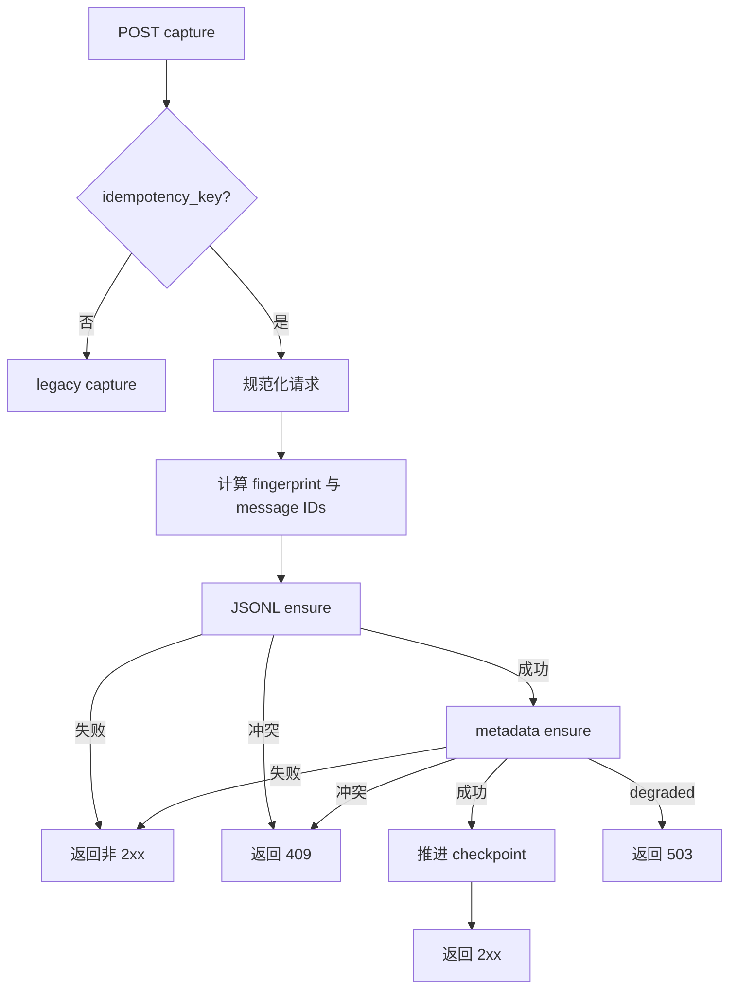

# 【云脑方案文档】Gateway 持久化语义

## 需求分析

为 keyed capture（带幂等键的请求）提供跨服务重启的重复识别、冲突检测和双存储完成边界；当前仅保留独立方案，不进入实施。

## 功能需求

### Keyed capture

- 仅携带 `idempotency_key` 的请求启用 strict durable capture。
- 幂等作用域为 `session_key + idempotency_key`。
- 相同作用域、相同请求可安全重放。
- 相同作用域、不同请求返回 409。
- 未携带 key 的请求保持 legacy（旧协议）行为。

### 确定性记录

- 服务端统一规范化 capture 请求。
- 每条 message 使用确定性 message ID。
- JSONL 与 metadata 使用同一 message ID。
- 两侧都保存 `idempotency_key` 与 `capture_fingerprint`。

### 双存储完成边界

- JSONL 与 metadata 都使用 create-or-verify。
- 单侧已有相同记录时，只补齐另一侧。
- 任一侧失败均不返回 2xx。
- 两侧完成后才推进 capture checkpoint（处理游标）。

### Schema migration（数据库迁移）

- SQLite 增加可空的 `idempotency_key` 与 `capture_fingerprint`。
- 历史 legacy 行保持为空。
- TCVDB L0 record 同步增加两个字段。

## 非功能需求

| 指标 | 要求 |
| --- | --- |
| keyed capture 成功边界 | JSONL 与 metadata 均完成 |
| 重复请求 | 不重复写入 |
| 冲突请求 | 返回 409，禁止覆盖 |
| metadata degraded | 返回 503 |
| legacy 请求 | 保持原行为 |
| embedding | 可后台执行，不影响持久化 ACK |

## 现状分析

当前 L0 capture 无法提供跨服务重启的幂等效果：

- JSONL 按日 append，缺少跨分片的确定性 ID 检查。
- metadata record ID 与 JSONL ID 不统一。
- 两侧写入失败可能被吞掉，调用方仍收到 2xx。
- checkpoint 可能在两侧均完成前推进。
- metadata degraded 时可能仍报告成功。
- 普通 upsert 会覆盖同 ID 的旧内容。
- L0 未持久化请求指纹，无法区分重复与冲突。

现有进程内重放缓存有时间与容量边界，服务重启后丢失，不能替代持久化的 create-or-verify。

## 收益与风险

### 收益

- 重试不会产生重复 L0 记录。
- 相同 key 的不同内容不会覆盖旧数据。
- 单侧成功后重试只补缺失侧。
- 2xx 具有明确的双存储完成含义。
- 公共 capture 调用方可复用同一语义。

### 风险

| 风险 | 约束 |
| --- | --- |
| JSONL 跨分片扫描增加 I/O | v1 先保证确定性与正确性 |
| 多进程并发写 JSONL | 扫描、校验、append 共用跨进程锁 |
| metadata 并发插入 | 在事务内 insert-if-absent 并校验 fingerprint |
| 历史数据没有 fingerprint | migration 字段可空，legacy 行不进入 strict 冲突判断 |
| 单侧成功 | 重试时 create-or-verify 并补另一侧 |

## 业务流程

### 核心流程



### 单侧恢复

| JSONL | metadata | 行为 |
| --- | --- | --- |
| 不存在 | 不存在 | 依次创建两侧 |
| 已有相同 fingerprint | 不存在 | 校验 JSONL，只创建 metadata |
| 不存在 | 已有相同 fingerprint | 创建 JSONL，校验 metadata |
| 已有相同 fingerprint | 已有相同 fingerprint | 重复成功 |
| 任一侧 fingerprint 不同 | 任意 | 返回 409 |

## 概要设计

### 输入与输出

| 请求/状态 | 输出 |
| --- | --- |
| 带 `idempotency_key` 的 capture | 2xx、重复成功、409 或可重试失败 |
| 不带 key 的 capture | legacy capture 结果 |
| metadata degraded | keyed 请求返回 503 |

### 规范化

服务端先将消息规范化：

- 请求含非空 `messages` 时，保持数组顺序，逐条使用 role 与 content。
- 请求未含 `messages` 时，依次生成 user 与 assistant 两条消息。
- keyed 请求显式传入空 `messages` 时返回 400；legacy 请求保持现有行为。
- `message_index` 从 0 开始，按规范化后的顺序递增。

`canonical_json` 使用 UTF-8 JSON：

- 对象键按 Unicode 码点升序排列。
- 不写空白。
- 数组保持顺序。
- `null` 保留。
- 未提供字段不加入对象。
- 字符串不做 Unicode 再归一化。

### 标识计算

```text
capture_fingerprint =
  sha256(canonical_json(normalized CaptureRequest excluding idempotency_key))

message_scope =
  sha256(canonical_json([session_key, idempotency_key]))

message_id =
  capture:v1:<message_scope>:<message_index>
```

不同 `session_key` 可独立使用相同 `idempotency_key`，互不冲突。

### Ensure

JSONL 与 metadata 都实现：

```text
ensure(message_id, capture_fingerprint, record)
```

| 已有状态 | 结果 |
| --- | --- |
| 不存在 | 创建 |
| 同 ID、同 fingerprint | 重复成功，不再次写入 |
| 同 ID、不同 fingerprint | 冲突，禁止覆盖 |

### JSONL

跨进程 L0 锁覆盖：

1. 扫描全部分片。
2. 按 message ID 查找记录。
3. 校验 fingerprint。
4. 不存在时 append。
5. 完成持久化后释放锁。

### Metadata

metadata 在存储事务内执行 insert-if-absent + fingerprint verification，不使用覆盖旧记录的普通 upsert。

SQLite 迁移：

- 为 `l0_conversations` 增加可空 `idempotency_key`。
- 增加可空 `capture_fingerprint`。
- 同步更新读取与写入语句。
- 历史行保持为空。

TCVDB L0 record 同步保存两个字段。

### 数据结构

| 字段 | 取值 | TTL | 用途 |
| --- | --- | --- | --- |
| `idempotency_key` | 请求提供的有界字符串 | 随 L0 保留 | 重试标识 |
| `capture_fingerprint` | 规范化请求 SHA-256 | 随 L0 保留 | 冲突检测 |
| message scope | session key + key 的哈希 | 随 L0 保留 | 幂等作用域 |
| message ID | `capture:v1:<scope>:<index>` | 随 L0 保留 | 双存储共用主键 |

## 交互接口

### `POST /capture`

| 请求类型 | 成功边界 |
| --- | --- |
| 无 `idempotency_key` | legacy 行为 |
| 有 `idempotency_key` | JSONL 与 metadata 均 ensure 成功 |

| 结果 | 含义 |
| --- | --- |
| 2xx | 两侧均完成或重复成功 |
| 409 | 相同作用域的 fingerprint 冲突 |
| 503 | metadata degraded |
| 其他非 2xx | 至少一侧未完成 |

## 失败语义

| 情况 | 行为 |
| --- | --- |
| 同 ID、同 fingerprint | 返回重复成功 |
| 同 ID、不同 fingerprint | 返回 409 |
| JSONL 失败 | 返回非 2xx |
| metadata 失败 | 返回非 2xx |
| metadata degraded | 返回 503 |
| embedding 失败 | 记录错误，不影响 ACK |

失败时不推进 checkpoint。下次相同请求从两侧当前状态继续 ensure。

## 验收标准

1. strict 语义只对携带 `idempotency_key` 的请求启用。
2. 幂等作用域为 `session_key + idempotency_key`。
3. 请求规范化与 message 顺序定义唯一。
4. key 与 fingerprint 下传 TdaiCore。
5. JSONL 与 metadata 使用确定性 message ID。
6. 两侧保存 key 与 fingerprint。
7. 两侧使用 create-or-verify，禁止覆盖冲突内容。
8. 单侧存在相同记录时只补另一侧。
9. 任一存储失败返回非 2xx；degraded 返回 503。
10. 两侧 ensure 均成功后才推进 checkpoint。
11. 同一作用域的不同 fingerprint 在服务重启后仍返回 409。
12. 未携带 key 的调用方保持 legacy 行为。
13. keyed 请求的空 `messages` 返回 400；未提供时生成 user 与 assistant 两条消息。
14. SQLite 完成 nullable 字段迁移，TCVDB schema 同步支持新字段。
