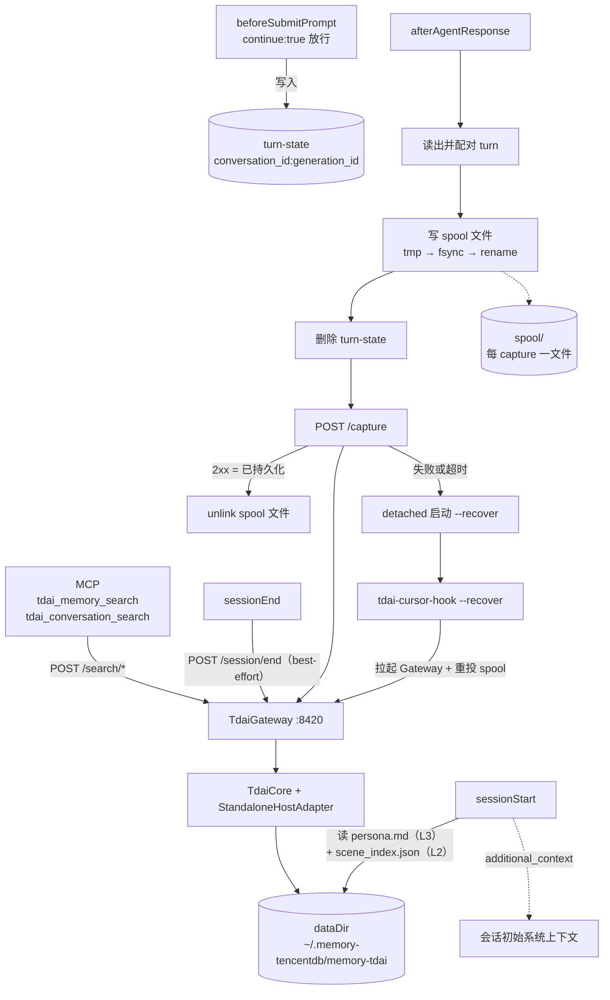

# Spec: Cursor Adapter

## 目的

**v1 只做分层长期记忆**（L0→L3 的召回与落库），符号短期记忆留到 Cursor 提供上下文改写能力之后。

| Non-goal | 说明 |
| --- | --- |
| 符号短期记忆 offload | Cursor 无每轮上下文改写点，`preCompact` 仅可观测（[hooks 文档](https://cursor.com/docs/hooks.md)） |
| Cloud agents | v1 未支持 |
| Cursor CLI | v1 未支持 |
| 多用户 / 多记忆库隔离 | v1 全局单库 |
| 每轮强制注入召回 | 轮内召回交给 Agent 主动调 MCP 工具 |

## 架构



记忆引擎复用现有 HTTP Gateway（`src/gateway/server.ts`），与 Hermes provider 同一条已验证路径。Cursor 侧只有薄客户端。

## 挂点映射

| Cursor 挂点 | 动作 | 依据 |
| --- | --- | --- |
| `sessionStart` | L3 与 L2 **分别读取**后拼成 `additional_context` | 唯一可注入初始系统上下文的挂点；`/recall` 要求非空 `query`（`src/gateway/server.ts:374`）而此挂点无 prompt，故直读文件（同 `src/core/hooks/auto-recall.ts:144-169`） |
| `beforeSubmitPrompt` | 记录 `prompt` 到 turn-state，返回 `continue:true` | `afterAgentResponse` 只提供 assistant `text`，user 消息必须在此捕获 |
| `afterAgentResponse` | 配对成 turn → `POST /capture` | 对应上游 `agent_end` / Hermes `sync_turn`（`src/core/tdai-core.ts:265`） |
| `sessionEnd` | `POST /session/end` | 只 flush 本会话，不 destroy（`src/core/tdai-core.ts:328` 明确区分两种语义） |
| MCP stdio server | 2 个检索工具 → `/search/*` | 轮内召回的唯一自动通道，Cursor 会按相关性自主调用 |

## 关键设计决策

**hook 产物零第三方依赖。** 每个 hook 都是一次全新进程；一旦 import `TdaiCore` 会连带拉起 sqlite-vec、`ai`、tiktoken，冷启动从 ~50ms 涨到 1s 以上。重活全部隔在 Gateway 侧。L2 导航所需的 `readSceneIndex` / `generateSceneNavigation` / `stripSceneNavigation` 传递依赖只有 `node:fs`、`node:path` 与 `scene-format`，在构建期直接打进 hook 产物，避免另起一份会漂移的复制品。构建产物需有断言：外部 import 仅限 `node:` 前缀。

**不做请求前 health check。** 直接 POST。连接失败或超时才触发拉起与补投，省掉每次一个 RTT。

**前台网络预算约 1s**（`captureRequestTimeoutMs`）。超时即视为失败，交给 spool 与 recover，绝不拖慢用户的一轮对话。

**turn-state 而非 transcript。** Cursor 提供 `transcript_path`，但文件格式未文档化。自建 turn-state 换取稳定性。

**effectively-once capture 由三件事共同构成**，缺一不可：

```text
Cursor durable spool      → 至少投递一次
capture_id 派生的确定性 L0 message ID → 重复投递无副作用
L0 写失败向 Gateway 传播  → 2xx 才代表已持久化
= 崩溃恢复条件下的 effectively-once
```

**write-ahead 顺序。** `afterAgentResponse` 先把 turn durable 落 spool，再删 turn-state，最后才 POST，收到 2xx 才 unlink spool。顺序反过来（先删 turn-state 再落盘）会在两步之间崩溃时永久丢一轮。

**幂等边界下沉到 L0 写入层，不能是旁路标记文件。** 旁路的 `captured.jsonl` 与 L0 JSONL 是两个文件、无共同事务：先写标记可能「标记成功、L0 未写」而丢失，先写 L0 可能「L0 成功、标记未写」而重复——典型双写不一致。正确做法是让 `capture_id` 派生确定性消息 ID（`capture:<capture_id>:user` / `:assistant`），由最终写入层按 ID 去重。当前 Gateway 构造的 messages **根本不带 id**（`src/gateway/server.ts:405-408`），落盘时走 `generateMessageId()` 的时间戳加随机值，同一请求重投必然产生不同 ID。

**去重索引用已有 SQLite，不查 JSONL。** L0 按天分片（`src/core/conversation/l0-recorder.ts:281-283`），跨零点的重投会落到不同 shard，只查当日文件会漏。store bundle 里已有 SQLite，用消息 ID 唯一约束即可。

**L3 与 L2 必须分别读取，`persona.md` 不是 L2 真源。** 两个独立原因：其一，`src/core/scene/scene-extractor.ts:456,467` 表明 PersonaGenerator 未跑过时**根本不会**写入导航，此时 `scene_index.json` 有内容而 `persona.md` 里没有；其二，`:448` 调 `generateSceneNavigation(index)` **不传 `dataDir`**，写进 persona.md 的路径是相对路径（`src/core/scene/scene-navigation.ts:44-46`），Agent 无法直接 `read_file`。故 `sessionStart` 复刻 `auto-recall.ts:144-169` 的做法：读 `persona.md` → `stripSceneNavigation` 取 L3 正文；独立 `readSceneIndex` → `generateSceneNavigation(index, dataDir)` 生成**绝对路径**导航；再按 `<user-persona>` / `<scene-navigation>` 拼装。

## 数据契约

| 键 | 取值 | 语义 |
| --- | --- | --- |
| `session_key` | `cursor:<conversation_id>` | 纯会话命名空间。L0 按此逐行过滤（`src/core/conversation/l0-recorder.ts:353-355`）；L1/L2/L3 在 dataDir 内全局可见，`session_key` **不是**隔离边界 |
| turn-state 键 | `<conversation_id>:<generation_id>` | `generation_id` 每条用户消息变化，保证并发与重复轮次不串味 |
| `capture_id` | `<conversation_id>:<generation_id>` | 幂等键，贯穿 Gateway → TdaiCore → auto-capture → L0 recorder |
| L0 消息 ID | `capture:<capture_id>:user` / `capture:<capture_id>:assistant` | 由 `capture_id` 确定性派生，是**最终幂等边界** |
| 隔离边界 | dataDir | v1 唯一隔离手段。`actorId` 上游硬编码 `default_user`（`src/core/tdai-core.ts:249`），`user_id` 不参与召回隔离 |

turn-state 落在 `~/.memory-tencentdb/cursor/turns/`。spool 是**每条 capture 一个文件**：`~/.memory-tencentdb/cursor/spool/<sha256(capture_id)>.json`，经「临时文件 → fsync → rename」发布，ACK 后 `unlink`。不用单个 append-only JSONL——JSONL 能安全追加但不能原地删除中间记录，多个 hook 与 recover 并发时还要额外引入 tombstone、跨进程锁和 compact 协议，一文件一条目直接消掉这些。turn-state 仅在 spool 文件 rename 成功后删除；`sessionEnd` 清理本会话残留；超过 24h 的孤儿 turn-state 在任意 hook 运行时顺带清除（spool 文件永不按时限清理，只能被 ACK 删除）。

## 上游改动

三处，都在 capture 链路上：

1. **`POST /capture` 增加可选字段 `capture_id`**，向下透传至 L0 recorder。字段可选，不影响 Hermes 与 OpenClaw 现有调用。
2. **L0 消息 ID 确定性化并去重**。Gateway 在构造 messages 时按 `capture_id` 赋确定性 ID（`src/gateway/server.ts:405-408` 当前不带 id），L0 写入层按 ID 去重，索引落已有 SQLite。
3. **L0 写入失败必须向上抛。** `src/core/conversation/l0-recorder.ts:290-293` 目前捕获 `appendFile` 异常后仅记日志，仍返回 `filtered`，注释写着「Return filtered messages anyway so L1 can still process them」。这会让 `/capture` 在 L0 根本没落盘的情况下返回 200，Cursor 随即删掉 spool——数据静默丢失。改为抛出，`/capture` 返回非 2xx。

第 3 项会改变 OpenClaw 与 Hermes 路径的既有行为（从静默降级变为失败）。这是有意的：`l0RecordedCount` 作为响应字段本就承诺了持久化语义。

## 失败语义

全部 fail-open，不设 `failClosed`。

| 情况 | 行为 |
| --- | --- |
| 任何异常 | 始终 `exit 0` 并输出 `{}`；日志写 `~/.memory-tencentdb/logs/cursor-hook.log`（带体积上限轮转） |
| `persona.md` 或 `scene_index.json` 缺失 | 各自静默跳过；两者皆无则返回 `{}`，不注入 |
| `/capture` 非 2xx、连接失败或超时 | spool 文件保留，detached 启动 `tdai-cursor-hook --recover` |
| `--recover` | 短生命周期进程：`scripts/memory-tencentdb-ctl.sh start`（lock 文件防并发）→ 有上限地轮询 `/health` → 重投 spool 目录内全部文件 → 退出 |
| spool | 仅承载 capture。`/search/*` 失败即丢弃（Agent 可重试） |
| `/session/end` 失败 | 直接丢弃，**不进 spool**，best-effort |

三个时间边界是不同的东西，配置项必须分开命名，否则实现容易把前台 hook 拖到 5s：

| 配置项 | 值 | 含义 |
| --- | --- | --- |
| `captureRequestTimeoutMs` | 1000 | hook 内单次 HTTP 请求超时，即「网络预算」 |
| `cursorHookTimeoutSeconds` | 5 | 写进 `hooks.json` 的进程总超时，仅作兜底 |
| `recoverHealthTimeoutMs` | 单独配置 | recover 等待 Gateway 起来的上限，与前台无关 |

关于 `/session/end` 的承诺范围，只能收窄到这一句：**Gateway 持续存活时，丢失 `/session/end` 只会延迟 L1；若 Gateway 在 idle timer 触发前非优雅退出，只保证 L0 已落盘，不保证该轮 L1 生成。** 依据是每次 capture 都会写入 buffer 并重置 L1 idle timer，L2 另有 downward-only timer 加 maxInterval 保证（`src/utils/pipeline-manager.ts:12,31-35,47,67-71`），所以 `/session/end` 只是加速；但这些 timer 与 buffer 都在进程内存（`:176`），强杀即丢。这是上游既有行为，v1 不额外处理。

## 代码布局

```
src/adapters/cursor/
  hook-router.ts     # 纯函数: payload -> 决策，无 IO
  session-start.ts   # L3 正文 + L2 绝对路径导航 -> additional_context
  turn-state.ts      # 暂存 / 配对 / 清理
  spool.ts           # durable spool: 发布 / ACK unlink / 重投
  gateway-client.ts  # 薄 HTTP + recover 触发
src/mcp/server.ts    # stdio MCP，2 工具转发 /search/*
bin/tdai-cursor-hook.mjs   # 唯一入口，按 hook_event_name 分派；支持 --recover
bin/tdai-mcp-server.mjs
scripts/install-cursor.sh
docs/cursor.md
```

MCP server 需新增 `@modelcontextprotocol/sdk` 依赖（当前仓库无 MCP 实现）。

## 安装与卸载

`scripts/install-cursor.sh` 写 `~/.cursor/hooks.json` 与 `~/.cursor/mcp.json`（用户级，与全局单库一致）。要求：

- **原子 merge**：读取现有 JSON → 合并本插件条目 → 写临时文件 → `rename` 覆盖。绝不整体覆盖用户已有配置。
- **绝对路径**：hook `command` 与 MCP `command` 均写绝对路径，不依赖 hook 工作目录。
- **幂等**：重复执行结果一致，按稳定标识替换旧条目。
- **卸载**：`--uninstall` 精确移除本插件写入的条目，保留其余配置。

另附一份 skill（`~/.cursor/skills/`）说明何时应调用记忆检索工具。

## 测试

| 层级 | 内容 |
| --- | --- |
| 单测 | `hook-router` 纯函数：prompt 丢失、乱序、重复 `generation_id`、未知事件 |
| 单测 | `session-start`：无 persona 但有 scene index 时导航仍注入；导航路径为**绝对路径**；两者皆无时返回 `{}` |
| 单测 | `spool` 崩溃语义：在「spool 已 rename、turn-state 未删」处注入中断，重放后恰好一条 capture |
| 构建断言 | hook 产物的外部 import 仅含 `node:` 前缀 |
| 契约测 | fake gateway 断言 `/capture` body 形状与 `capture_id` 透传 |
| 契约测 | 幂等：同 `capture_id` 重投 3 次、且**跨 Gateway 重启**、且**跨天分片**，L0 仍只有一份 |
| 契约测 | L0 写失败（目录只读）时 `/capture` 返回非 2xx，且 spool 文件未被删除 |
| E2E | `vitest.e2e.config.ts`：**临时端口 + 临时 dataDir**，跑完整 hook 序列，断言 L0 落盘 |
| E2E | 不发 `/session/end`，把 `l1IdleTimeoutSeconds` 调至极短，断言 L1 仍被 idle timer 触发 |
| 人工 | Cursor Hooks 输出通道 + `~/.memory-tencentdb/logs` |

## 验收标准

1. `sessionStart` 的 `additional_context` 含 `<user-persona>` 与 `<scene-navigation>` 两段，且**尚未生成 persona 时导航仍出现**。
2. 导航中的 Path 是绝对路径，Agent 能直接 `read_file` 读到对应场景块——L2 召回链闭合。
3. 一轮对话结束后，`dataDir/conversations/*.jsonl` 出现该 `session_key` 的 user 与 assistant 记录，ID 为 `capture:<capture_id>:*`。
4. 同一 `capture_id` 重投 3 次、跨 Gateway 重启、跨天分片，L0 始终只有一份记录。
5. L0 写入失败时 `/capture` 返回非 2xx，spool 文件保留，恢复可写后重投成功落库。
6. 在「spool 已 rename、turn-state 未删」处强杀进程，重放后该轮恰好落库一次，不丢不重。
7. Gateway 未运行时完成一轮对话，Gateway 被自动拉起，且该轮记忆最终落库。
8. 不发 `/session/end` 且 Gateway 持续存活时，L1 仍在 idle timeout 后生成。
9. MCP 两个工具在 Cursor 工具列表可见，Agent 调用能返回检索结果。
10. 每个 hook 单次墙钟耗时 < 1.2s；`captureRequestTimeoutMs` 生效，前台不会等满 5s。
11. `install-cursor.sh` 在已有 `hooks.json`/`mcp.json` 的机器上执行后，原有条目完好；`--uninstall` 后配置回到执行前状态。
